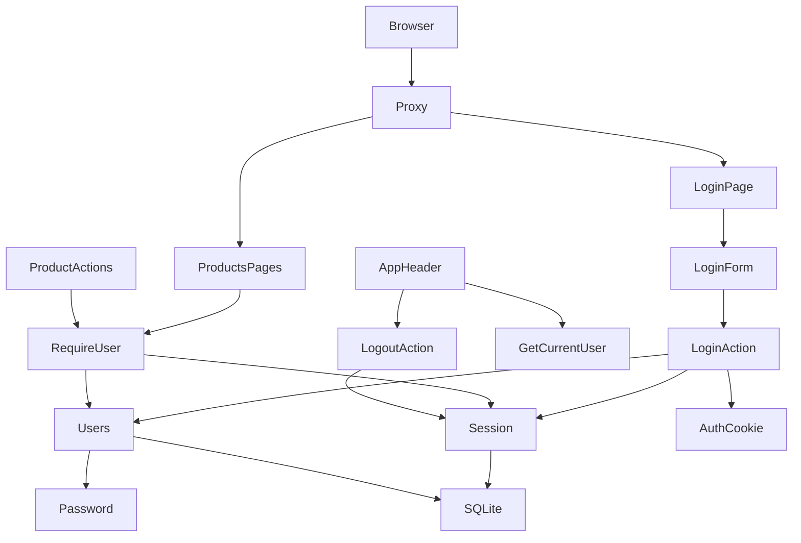
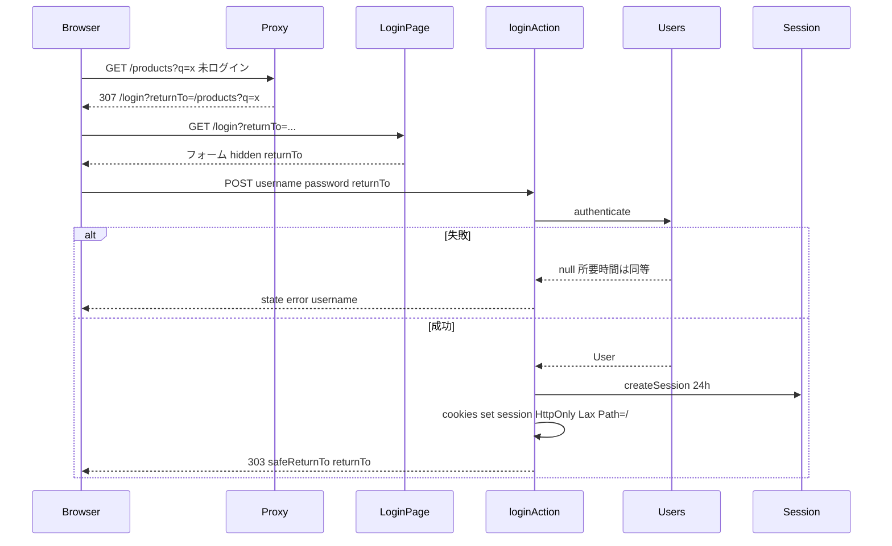

# Design Document: auth-login

## Overview

**Purpose**: username / password によるログインと 24 時間の DB セッションを追加し、`/products` 配下の画面と操作をログイン済みユーザーに限定する。
**Users**: 初期ユーザー admin / editor / viewer(ロールは次 step)。
**Impact**: users / sessions テーブル(migration 003)、パスワード・セッション・ユーザーのライブラリ、`/login` 画面と Server Action、Proxy、共通ヘッダの Server Component 化、既存ページと Server Action への `requireUser()` 追加。

### Goals
- ログイン / ログアウトが JS 無効でも動き、失敗時は同一メッセージで username を保持する
- 未ログインの `/products` 配下アクセスは `/login?returnTo=` へ。ログイン後に元の URL へ戻る
- セッションはサーバで毎回検証し、ログアウトで即時失効、24 時間で期限切れ
- パスワードは scrypt + ソルトで保存、`node:crypto` のみ

### Non-Goals
- 認可(ロールごとの操作制限)、ユーザー管理画面、パスワード変更、試行回数制限、期限延長、Secure Cookie(https 配備時の課題)

## Boundary Commitments

### This Spec Owns
- users / sessions のスキーマと、パスワードハッシュ(`password.ts`)、セッション(`session.ts`)、ユーザー(`users.ts`)の各ライブラリ
- 現在ユーザーの取得と保護(`auth.ts`: `getCurrentUser` / `requireUser` / Cookie 操作)
- `/login` 画面、`loginAction` / `logoutAction`、Proxy、共通ヘッダ
- 既存ページ・Server Action への `requireUser()` の挿入(挿入位置は各 spec の所有物だが、挿入は本 spec の責務)
- 初期ユーザーのシードと README の記載

### Out of Boundary
- ロール列と権限判定(次 step。users テーブルへの列追加は次 step の migration で行う)
- products のスキーマ・挙動

### Allowed Dependencies
- `node:crypto`、`next/headers`(`cookies`)、`next/navigation`(`redirect`)、`next/server`(Proxy)
- `product-master` の `getDb`、migration の仕組み、`nowIso`
- `product-bookmark` の `safeReturnTo`
- 依存方向: `password → users → auth`、`session → auth`、`auth → app(pages, actions) → components`。`auth.ts` だけが Next の request API に依存する

### Revalidation Triggers
- `User` 型の変更(次 step で `role` が加わる)
- `requireUser()` の戻り値・redirect 先の変更
- Cookie 名・属性・セッション期限の変更
- Proxy の `matcher` の変更

## Architecture

### Architecture Pattern & Boundary Map



**Architecture Integration**:
- Selected pattern: DB セッション + HttpOnly Cookie、Proxy は楽観チェック、DAL(`requireUser`)で検証(`research.md`)
- Domain/feature boundaries: 純粋ロジック(`password` / `session` / `users`)と Next 依存の薄い層(`auth`)を分離。UI は Server Component、client component はログインフォームのみ
- Existing patterns preserved: フォーム + Server Action + `redirect`。`lib` にロジック、テストは `lib` に集中
- New components rationale: `AppHeader`(username とログアウトの表示に `cookies()` が要る)、`LoginForm`(`useActionState` でエラーと username を扱う)
- Steering compliance: ライブラリ追加なし、`node:crypto`、平文保存禁止、migration は追記のみ、機能にテスト

### Technology Stack

| Layer | Choice / Version | Role in Feature | Notes |
|-------|------------------|-----------------|-------|
| Security | `node:crypto`(scrypt, randomBytes, timingSafeEqual) | ハッシュ、セッション ID、比較 | ライブラリなし |
| Backend | Next.js Server Action、`cookies()`、`redirect()`、Proxy | ログイン / ログアウト / 保護 | Proxy は Node ランタイム |
| Data | SQLite(migration 003) | users、sessions | `ON DELETE CASCADE` |
| Frontend | Server Components、`useActionState`(LoginForm のみ) | ヘッダ、ログイン画面 | JS 無効でも POST は動く |
| Testing | Vitest 4 | password / session / users | Proxy・画面は手動 + curl |

## File Structure Plan

### Directory Structure
```
db/migrations/
└── 003_create_users_and_sessions.sql   # 新規
src/
├── proxy.ts                            # 新規: /products/:path* で Cookie がなければ /login?returnTo= へ
├── app/
│   └── login/
│       ├── page.tsx                    # 新規: ログイン済みなら /products へ。LoginForm を描画
│       └── actions.ts                  # 新規: loginAction(useActionState 用)、logoutAction
├── components/
│   ├── app-header.tsx                  # 新規: Server Component。username + ログアウト(form)
│   └── login-form.tsx                  # 新規: 'use client'。useActionState、エラー表示、username 保持
└── lib/
    ├── password.ts                     # 新規: hashPassword / verifyPassword / DUMMY_HASH(純粋)
    ├── session.ts                      # 新規: createSession / getSession / deleteSession(DB)
    ├── users.ts                        # 新規: User 型、findUserByUsername / getUserById / authenticate / seedUsersIfEmpty
    └── auth.ts                         # 新規: getCurrentUser / requireUser / setSessionCookie / clearSessionCookie(Next 依存)
tests/
├── password.test.ts                    # 新規
├── session.test.ts                     # 新規
└── users.test.ts                       # 新規(シード、authenticate)
```

### Modified Files
- `src/lib/db.ts` — bootstrap で `seedUsersIfEmpty(db)` を products のシードの後に呼ぶ
- `src/app/layout.tsx` — 静的ヘッダを `<AppHeader />` に置き換える
- `src/app/products/page.tsx`、`src/app/products/[id]/page.tsx` — 先頭で `await requireUser(現在の URL)` を呼ぶ
- `src/app/products/actions.ts` — 3 つの action の先頭で `await requireUser()` を呼ぶ
- `tests/db.test.ts` — 適用済み migration の期待値を 3 件に更新
- `README.md` — ログイン方法と初期ユーザー
- `.kiro/steering/structure.md` — `lib/auth.ts` の例外(Next の request API 依存)を追記

## System Flows

### ログイン



### 保護されたページ / action
- `requireUser(returnTo?)`: Cookie の `session` → `getSession`(期限切れなら削除して null)→ `getUserById`。いずれか null なら `redirect(/login?returnTo=...)`(returnTo 省略時はクエリなし)。成功なら `User`

## Requirements Traceability

| Requirement | Summary | Components | Interfaces | Flows |
|-------------|---------|------------|------------|-------|
| 1.1, 1.7 | ログイン画面、JS 不要 | LoginPage, LoginForm | form action | ログイン |
| 1.2 | 成功でセッション | LoginAction, Users, Session, AuthCookie | `authenticate`, `createSession`, `setSessionCookie` | ログイン |
| 1.3, 1.4 | 同一エラー、username 保持 | LoginAction, LoginForm | `LoginState` | ログイン |
| 1.5 | ログイン済みで /login | LoginPage | `getCurrentUser` | - |
| 1.6 | 所要時間の均一化 | Users | `authenticate`(ダミーハッシュ) | - |
| 2.1 | returnTo 付きで /login へ | Proxy | `matcher`, `NextResponse.redirect` | ログイン |
| 2.2, 2.3 | 復帰先へ / 既定 | LoginAction | `safeReturnTo` | ログイン |
| 2.4 | `/` → /login | next.config redirects + Proxy | - | - |
| 3.1, 3.2 | Cookie 属性 | AuthCookie | `setSessionCookie` | - |
| 3.3, 3.4 | 24h、期限切れ | Session, RequireUser | `SESSION_TTL_MS`, `getSession` | - |
| 3.5, 3.6 | 偽造 / 毎回検証 | RequireUser | `getSession` | 保護 |
| 3.7 | 128 ビット以上 | Session | `randomBytes(32)` | - |
| 3.8 | 複数セッション | Session | 行 = セッション | - |
| 4.1 | 画面の保護 | Proxy, ProductsPages | `requireUser(url)` | 保護 |
| 4.2 | action の保護 | ProductActions | `requireUser()` | 保護 |
| 4.3 | /login と静的は素通し | Proxy | `matcher: /products/:path*` | - |
| 4.4 | 既存機能は現行どおり | - | 既存テスト維持 | - |
| 5.1, 5.2 | ヘッダ表示 / 非表示 | AppHeader | `getCurrentUser` | - |
| 5.3, 5.4, 5.5 | ログアウト、再利用無効、JS 不要 | LogoutAction, Session | `deleteSession`, `clearSessionCookie` | - |
| 6.1, 6.6, 6.7 | users テーブル、一意、migration 003 | Migration003 | - | - |
| 6.2, 6.3 | scrypt + ソルト、node:crypto | Password | `hashPassword`, `verifyPassword` | - |
| 6.4, 6.5 | 初期ユーザー、再投入なし | Users, DbBootstrap | `seedUsersIfEmpty` | - |
| 7.1 | README | README | - | - |
| 7.2, 7.3 | テスト、build / lint / test | tests/* | - | - |

## Components and Interfaces

| Component | Domain/Layer | Intent | Req Coverage | Key Dependencies (P0/P1) | Contracts |
|-----------|--------------|--------|--------------|--------------------------|-----------|
| Migration003 | db | users / sessions | 6.1, 6.6, 6.7 | DbBootstrap (P0) | - |
| Password | lib(純粋) | scrypt ハッシュと検証 | 6.2, 6.3, 1.6 | node:crypto (P0) | Service |
| Session | lib(DB) | セッションの CRUD と期限 | 3.3–3.8, 5.3, 5.4 | getDb (P0) | Service |
| Users | lib(DB) | ユーザー取得、認証、シード | 1.2, 1.6, 6.4, 6.5 | Password (P0), getDb (P0) | Service |
| Auth(`auth.ts`) | lib(Next 依存) | 現在ユーザー、保護、Cookie | 3.1, 3.2, 3.5, 3.6, 4.1, 4.2 | Session, Users (P0), next/headers, next/navigation (P0) | Service |
| Proxy | app 境界 | 楽観リダイレクト | 2.1, 4.1, 4.3 | next/server (P0) | - |
| LoginPage / LoginForm | app / components | 画面 | 1.1, 1.3, 1.4, 1.5, 1.7 | LoginAction (P0) | State |
| LoginAction / LogoutAction | app | 認証・セッション発行 / 破棄 | 1.2, 1.3, 2.2, 2.3, 5.3, 5.5 | Users, Session, Auth (P0) | Service |
| AppHeader | components | username とログアウト | 5.1, 5.2 | Auth (P0), LogoutAction (P0) | - |
| ProductsPages / ProductActions(拡張) | app | `requireUser()` 挿入 | 4.1, 4.2, 4.4 | Auth (P0) | - |

### lib 層

#### Password(`src/lib/password.ts`)
```typescript
/** "scrypt$N$r$p$<salt base64url>$<hash base64url>"。salt は 16 バイト乱数、hash は 64 バイト */
export function hashPassword(plain: string): string;
/** 保存形式を解釈して再計算し timingSafeEqual で比較。形式不正は false */
export function verifyPassword(plain: string, stored: string): boolean;
/** 未知ユーザーの所要時間均一化に使う固定ハッシュ(モジュール読み込み時に 1 回生成) */
export const DUMMY_HASH: string;
```
- Invariants: 同じ平文でも毎回異なる文字列(ソルト)。`verifyPassword(p, hashPassword(p)) === true`
- Validation: `tests/password.test.ts` — 形式、往復、別ソルト、誤パスワード、空文字、壊れた形式

#### Session(`src/lib/session.ts`)
```typescript
export const SESSION_TTL_MS = 24 * 60 * 60 * 1000;
export interface Session { id: string; userId: number; createdAt: string; expiresAt: string }
/** randomBytes(32).toString("base64url") を ID に、期限 = now + TTL で挿入 */
export function createSession(userId: number, now?: Date): Session;
/** 存在し期限内なら返す。期限切れは削除して null。不在は null */
export function getSession(id: string, now?: Date): Session | null;
export function deleteSession(id: string): void;
```
- Validation: `tests/session.test.ts` — 作成と取得、`now` を 24h 後にすると null かつ削除される、不在、削除後 null、同一ユーザーで 2 セッション、ID 長(43 文字)と一意性

#### Users(`src/lib/users.ts`)
```typescript
export interface User { id: number; username: string }
export function getUserById(id: number): User | null;
/** username と password を検証。不在でもダミーハッシュを検証して所要時間を揃える。空は null */
export function authenticate(username: string, password: string): User | null;
export const SEED_USERS: readonly { username: string; password: string }[]; // admin / editor / viewer
/** users が 0 件なら SEED_USERS をハッシュ化して投入し件数を返す。それ以外は 0 */
export function seedUsersIfEmpty(db: Database.Database): number;
```
- Validation: `tests/users.test.ts` — 空 DB で 3 件、再投入なし、`authenticate` の成功 / 誤パスワード / 不在 / 空、`password_hash` が平文でない

#### Auth(`src/lib/auth.ts`、Next 依存)
```typescript
export const SESSION_COOKIE = "session";
/** Cookie → getSession → getUserById。いずれか無効なら null */
export async function getCurrentUser(): Promise<User | null>;
/** null なら redirect("/login" + (returnTo ? "?returnTo=" + encodeURIComponent(returnTo) : "")) */
export async function requireUser(returnTo?: string): Promise<User>;
/** Server Action 専用。HttpOnly, SameSite=Lax, Path=/, expires = session.expiresAt */
export async function setSessionCookie(session: Session): Promise<void>;
export async function clearSessionCookie(): Promise<void>;
```
- Implementation Notes: `getCurrentUser` は同一リクエスト内で複数回呼ばれ得る(ヘッダとページ)。React の `cache()` で包み DB 照合を 1 回にする

### app 層

#### Proxy(`src/proxy.ts`)
- `matcher: ["/products/:path*"]`。`request.cookies.get("session")` がなければ `NextResponse.redirect(new URL("/login?returnTo=" + encodeURIComponent(pathname + search), request.url))`。あれば `NextResponse.next()`(検証はしない)

#### LoginPage(`src/app/login/page.tsx`)
- `await getCurrentUser()` が非 null なら `redirect("/products")`。`searchParams.returnTo` を `LoginForm` に渡す

#### LoginAction / LogoutAction(`src/app/login/actions.ts`)
```typescript
export type LoginState = { error?: string; username?: string };
export async function loginAction(prev: LoginState, formData: FormData): Promise<LoginState>; // 成功時は redirect(safeReturnTo(returnTo)) を投げるので戻らない
export async function logoutAction(): Promise<void>; // Cookie の session を deleteSession → clearSessionCookie → redirect("/login")
```
- 失敗時: `{ error: "username か password が正しくありません", username }`。password は返さない

#### LoginForm(`src/components/login-form.tsx`)
- `'use client'`。`useActionState(loginAction, {})`。username(`defaultValue={state.username}`)、password、hidden `returnTo`、送信(`disabled={pending}`)。`state.error` を `role="alert"` で表示
- 判定済み(実装時に curl で確認): JS 無効のフォーム送信でも Next.js は action の戻り値を初期状態として再描画し、`state.error` と `username` が HTML に含まれる(HTTP 200)。代替案(クエリ方式)は不要

#### AppHeader(`src/components/app-header.tsx`)
- Server Component。`await getCurrentUser()`。ユーザーがいればアプリ名 + 商品一覧リンク + 右側に username と `<form action={logoutAction}><button>ログアウト</button></form>`。いなければアプリ名のみ

#### 既存ページ・action の変更
- `products/page.tsx`: `await requireUser(buildProductsUrl(現在の状態))` を先頭で
- `[id]/page.tsx`: `await requireUser(`/products/${rawId}`)`(id 解析より前に呼ぶ。不正 id でもまずログインへ)
- `actions.ts` の 3 action: 先頭で `await requireUser()`(returnTo なし。redirect は `try/catch` の外)

## Data Models

### Physical Data Model(`db/migrations/003_create_users_and_sessions.sql`)
```sql
CREATE TABLE users (
  id            INTEGER PRIMARY KEY AUTOINCREMENT,
  username      TEXT    NOT NULL UNIQUE,
  password_hash TEXT    NOT NULL,
  created_at    TEXT    NOT NULL
);

CREATE TABLE sessions (
  id         TEXT    PRIMARY KEY,
  user_id    INTEGER NOT NULL REFERENCES users(id) ON DELETE CASCADE,
  created_at TEXT    NOT NULL,
  expires_at TEXT    NOT NULL
);
CREATE INDEX idx_sessions_user_id ON sessions(user_id);
```
- `foreign_keys = ON` は `db.ts` で既に設定済み。role 列は次 step の migration 004 で追加する

## Error Handling
- 認証失敗: 同一メッセージ、username 保持、HTTP 200(フォーム再表示)
- 未ログイン: 画面は `/login?returnTo=`、action は `/login`(returnTo なし)
- 不正な returnTo: `/products`
- 期限切れ Cookie: 未ログイン扱い。Cookie 自体は次の set / clear まで残る(害なし)

## Testing Strategy
- **Unit**: `password.test.ts`
- **Integration(実ファイル DB)**: `session.test.ts`、`users.test.ts`、`db.test.ts`(003 適用)
- **手動 E2E + curl**: 未ログインで `/products?q=ST` → `/login?returnTo=` → 誤パスワードで同一エラー・username 保持 → 正しいパスワードで `/products?q=ST` に戻る → ヘッダに username → 別タブで偽 Cookie は `/login` → ログアウト → 同じ Cookie 値で再アクセスすると `/login` → curl で JS なしログイン(303 と Set-Cookie)、未ログインで Server Action POST → `/login`

## Security Considerations
- パスワード: scrypt(N=16384, r=8, p=1)、16 バイトソルト、`timingSafeEqual`
- セッション ID: 256 ビット乱数、DB 保存、Cookie は HttpOnly + SameSite=Lax
- CSRF: Server Action の Origin 検査(Next 標準)+ SameSite=Lax
- オープンリダイレクト: `safeReturnTo`
- 未実装(Non-Goals): 試行回数制限、Secure 属性(https 時)、セッション固定化対策としてのログイン時の旧セッション破棄(ログイン時は常に新 ID を発行するため実質問題なし)
