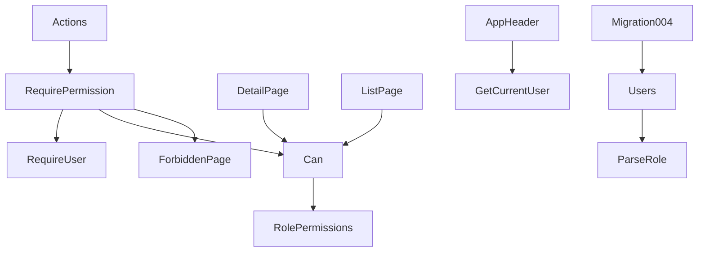
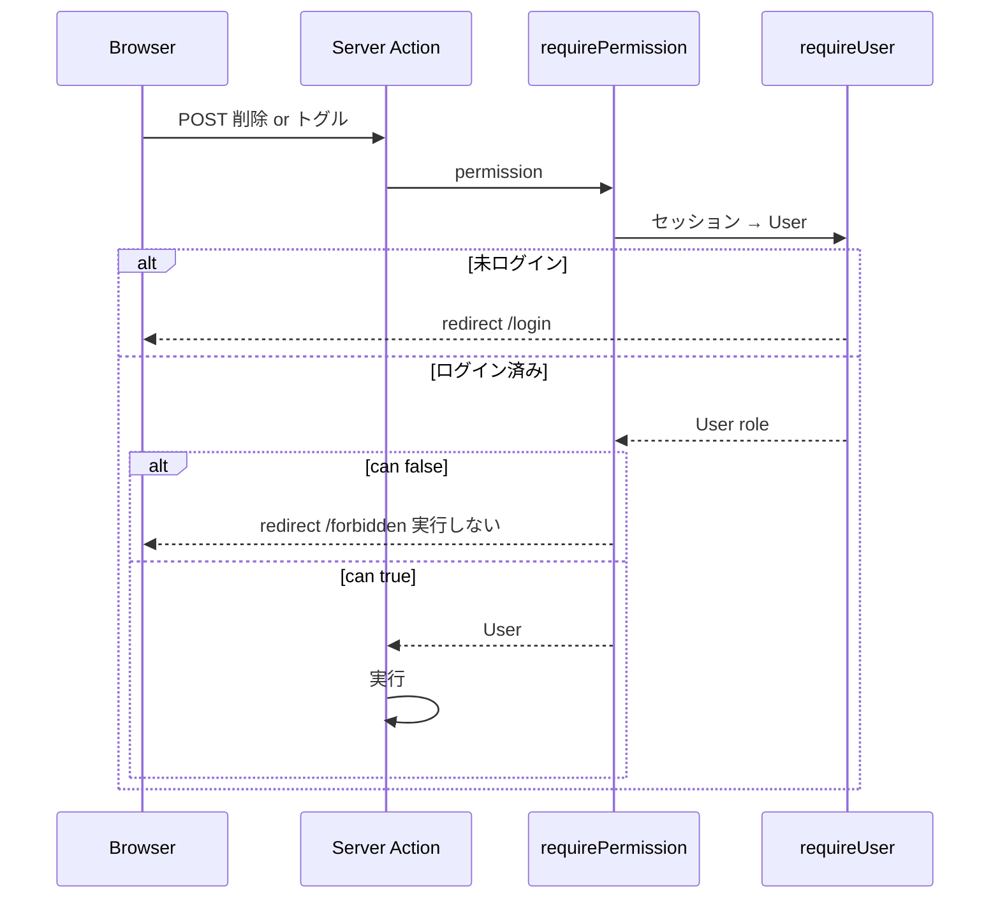

# Design Document: authz-roles

## Overview

**Purpose**: ユーザーに admin / editor / viewer のロールを持たせ、編集・削除・ブックマーク切り替えをロールで制限する。画面は権限のない操作を出さず、Server Action はセッション由来のロールで検査して拒否する。
**Users**: 初期ユーザー admin / editor / viewer。
**Impact**: migration 004 で `users.role` を追加し、`User` に `role` を載せる。権限表と判定関数を新設し、3 つの Server Action と 2 つの画面、ヘッダ、ブックマーク部品に組み込む。`/forbidden` ページを追加する。

### Goals
- 権限表を 1 か所に定義し、画面とサーバが同じ判定関数を使う
- フォーム偽装・URL 直打ちでも権限のない操作はデータを変えない
- 既存 DB の初期ユーザーにロールが付く

### Non-Goals
- ロール変更 UI、ユーザー管理、商品単位の権限、閲覧制限、Next の experimental `forbidden()`

## Boundary Commitments

### This Spec Owns
- `users.role` 列(migration 004)と `Role` 型・`parseRole`
- 権限表(`ROLE_PERMISSIONS`)と判定(`can`)、`requirePermission`
- `/forbidden` ページ
- 既存 action・画面・部品への検査と出し分けの挿入(挿入は本 spec の責務。各機能の挙動自体は各 spec 所有)

### Out of Boundary
- 認証(セッション、ログイン画面)の挙動
- products のスキーマと機能

### Allowed Dependencies
- `auth-login` の `requireUser` / `getCurrentUser` / `User`
- `next/navigation`(`redirect`)は `auth.ts` 経由のみ
- 依存方向: `authz(純粋) → users → auth → app / components`

### Revalidation Triggers
- `Permission` の追加(権限表とテストの更新が必須)
- `User.role` の型変更
- 拒否時の遷移先(`/forbidden`)の変更

## Architecture

### Architecture Pattern & Boundary Map



**Architecture Integration**:
- Selected pattern: ロール → 権限の静的表(`research.md`)
- Domain/feature boundaries: 権限表と判定は純粋モジュール `authz.ts`。Next 依存の `requirePermission` は `auth.ts` に置く(`auth-login` で定めた「Next 依存は auth.ts のみ」を維持)
- Existing patterns preserved: `requireUser()` の後段に検査を足す。フォーム + Server Action + `redirect`
- New components rationale: `ForbiddenPage`(拒否の着地先)。部品の新設はなし(`BookmarkToggle` に props 追加)
- Steering compliance: migration は追記のみ、ライブラリなし、機能にテスト

### Technology Stack

| Layer | Choice / Version | Role in Feature | Notes |
|-------|------------------|-----------------|-------|
| Data | SQLite `ADD COLUMN ... CHECK` | `users.role` | migration 004 |
| Backend | Server Action + `redirect("/forbidden")` | 拒否 | `forbidden()` は使わない |
| Frontend | Server Components | 出し分け | client component の変更なし |
| Testing | Vitest 4 | 権限表、ロール解釈、migration、シード | 偽装要求は curl |

## File Structure Plan

### Directory Structure
```
db/migrations/
└── 004_add_role_to_users.sql       # 新規: ADD COLUMN + 初期ユーザーへの UPDATE
src/
├── app/forbidden/page.tsx          # 新規: 権限がない旨と一覧へのリンク
└── lib/authz.ts                    # 新規: Role, ROLES, parseRole, Permission, ROLE_PERMISSIONS, can(純粋)
tests/
└── authz.test.ts                   # 新規: 権限表の全組み合わせ、parseRole
```

### Modified Files
- `src/lib/users.ts` — `User.role: Role`、SELECT に `role`、`SEED_USERS` に `role`(= username)、`seedUsersIfEmpty` が role を投入
- `src/lib/auth.ts` — `requirePermission(permission): Promise<User>`(`requireUser` → `can` → 不許可なら `redirect("/forbidden")`)
- `src/app/products/actions.ts` — 削除: `requirePermission("product:delete")`、トグル: `requirePermission("bookmark:toggle")`、更新: `requireUser()` の後に `can(user.role, "product:edit")` で `formError`
- `src/app/products/[id]/page.tsx` — `user` を受け、編集は `can(edit)`、削除は `can(delete)`、`BookmarkToggle` に `canToggle={can(bookmark:toggle)}`
- `src/app/products/page.tsx` — `user` を受け、各行の `BookmarkToggle` に `canToggle`
- `src/components/bookmark-toggle.tsx` — `canToggle?: boolean`(既定 true)。false なら印のみ
- `src/components/app-header.tsx` — username の横にロール
- `tests/users.test.ts` — 期待キーに `role`、シードとログインのロールを検証(既存テスト改変)
- `tests/db.test.ts` — migration 4 件、既存ユーザー DB に 004 を適用すると role = username、他の列不変(既存テスト改変)
- `README.md` — ロールと操作の対応表

## Requirements Traceability

| Requirement | Summary | Components | Interfaces | Flows |
|-------------|---------|------------|------------|-------|
| 1.1, 1.2, 1.6 | role 列、CHECK、migration 004 | Migration004 | - | - |
| 1.3 | 既存ユーザーに適用 | Migration004 | `UPDATE users SET role = username` | - |
| 1.4 | シードのロール | Users | `SEED_USERS`, `seedUsersIfEmpty` | - |
| 1.5 | 不正値は viewer | ParseRole | `parseRole` | - |
| 2.1, 2.2, 2.3, 2.4, 2.5 | 権限表 | RolePermissions, Can | `ROLE_PERMISSIONS`, `can` | - |
| 3.1, 3.2, 3.3 | 編集・削除ボタンの出し分け | DetailPage | `can` | - |
| 3.4, 3.5 | トグルの出し分け | ListPage, DetailPage, BookmarkToggle | `canToggle` | - |
| 3.6 | 閲覧 UI は従来どおり | - | 既存テスト維持 | - |
| 4.1, 4.2, 4.3 | サーバ側検査 | Actions, RequirePermission, Can | `requirePermission`, `can` | 拒否 |
| 4.4 | 遷移型の拒否 | RequirePermission, ForbiddenPage | `redirect("/forbidden")` | 拒否 |
| 4.5 | モーダル内の拒否 | UpdateAction | `formError` | 拒否 |
| 4.6, 4.7, 4.8 | 順序・セッション由来・未ログイン | RequirePermission | `requireUser` → `can` | 拒否 |
| 5.1 | ヘッダのロール | AppHeader | `User.role` | - |
| 5.2 | README | README | - | - |
| 6.1 | テスト | tests/* | - | - |
| 6.2 | 偽装要求の確認 | 検証手順(curl) | - | - |
| 6.3 | build / lint / test | - | - | - |

## System Flows



- 更新 action は `requireUser` の後に `can` を評価し、false なら `{ status: "error", errors: {}, formError }` を返す(モーダル内表示)

## Components and Interfaces

| Component | Domain/Layer | Intent | Req Coverage | Key Dependencies (P0/P1) | Contracts |
|-----------|--------------|--------|--------------|--------------------------|-----------|
| Migration004 | db | role 列と初期適用 | 1.1, 1.2, 1.3, 1.6 | - | - |
| Authz(`authz.ts`) | lib(純粋) | Role、権限表、判定 | 1.5, 2.1–2.5 | - | Service |
| Users(拡張) | lib | role の読み書き | 1.4 | Authz (P0) | Service |
| Auth(拡張) | lib(Next 依存) | `requirePermission` | 4.1–4.4, 4.6–4.8 | Authz, requireUser (P0) | Service |
| Actions(拡張) | app | 検査の挿入 | 4.1–4.5 | Auth (P0) | - |
| ListPage / DetailPage(拡張) | app | 出し分け | 3.1–3.6 | Authz (P0) | - |
| BookmarkToggle(拡張) | components | 印のみ表示 | 3.4, 3.5 | - | - |
| AppHeader(拡張) | components | ロール表示 | 5.1 | - | - |
| ForbiddenPage | app | 拒否の着地先 | 4.4 | - | - |

### lib 層

#### Authz(`src/lib/authz.ts`)
```typescript
export const ROLES = ["admin", "editor", "viewer"] as const;
export type Role = (typeof ROLES)[number];
/** 3 値以外(null / 空 / 未知)は "viewer" */
export function parseRole(raw: unknown): Role;

export const PERMISSIONS = ["product:view", "product:edit", "product:delete", "bookmark:toggle"] as const;
export type Permission = (typeof PERMISSIONS)[number];

/** 唯一の権限表。画面とサーバの両方がこれを参照する */
export const ROLE_PERMISSIONS: Record<Role, readonly Permission[]> = {
  viewer: ["product:view"],
  editor: ["product:view", "product:edit", "bookmark:toggle"],
  admin:  ["product:view", "product:edit", "bookmark:toggle", "product:delete"],
};
export function can(role: Role, permission: Permission): boolean;
```
- Validation: `tests/authz.test.ts` — 3 ロール × 4 操作の 12 通りを表で明示、`parseRole` の `"admin"` / `"ADMIN"`(→ viewer) / `null` / `""` / `"root"`

#### Users(拡張)
```typescript
export interface User { id: number; username: string; role: Role }
export const SEED_USERS: readonly { username: string; password: string; role: Role }[];
```
- SELECT に `role` を含め `parseRole` を通す。`seedUsersIfEmpty` は `role` も INSERT

#### Auth(拡張、`src/lib/auth.ts`)
```typescript
/** requireUser() の後、can() が false なら redirect("/forbidden")。FormData や URL の値は使わない */
export async function requirePermission(permission: Permission, returnTo?: string): Promise<User>;
```

### app 層

#### Actions(拡張)
- `deleteProductAction`: `await requirePermission("product:delete")`
- `toggleBookmarkAction`: `await requirePermission("bookmark:toggle")`
- `updateProductAction`: `const user = await requireUser(); if (!can(user.role, "product:edit")) return { status: "error", errors: {}, formError: "この操作を行う権限がありません" };`
- いずれも既存の処理より前(データ変更前)

#### DetailPage(拡張)
- `const user = await requireUser(...)`。`can(user.role, "product:edit") && <EditProductModal />`、`can(user.role, "product:delete") && <DeleteButton />`、`<BookmarkToggle canToggle={can(user.role, "bookmark:toggle")} />`

#### ListPage(拡張)
- `const user = await requireUser(returnTo)`。各行 `<BookmarkToggle canToggle={can(user.role, "bookmark:toggle")} />`

#### BookmarkToggle(拡張)
- `canToggle = true` のとき従来どおりフォーム。false のとき `<span aria-label="ブックマーク中" | "ブックマークなし">★|☆</span>`(ラベル表示は `label` に従う)

#### AppHeader(拡張)
- `ログイン中: {username}({role})`

#### ForbiddenPage(`src/app/forbidden/page.tsx`)
- 見出し「この操作を行う権限がありません」、説明、`/products` へのリンク。ログイン不要で表示可能(Proxy の matcher 外)

## Data Models

### Physical Data Model(`db/migrations/004_add_role_to_users.sql`)
```sql
ALTER TABLE users ADD COLUMN role TEXT NOT NULL DEFAULT 'viewer'
  CHECK (role IN ('admin', 'editor', 'viewer'));
UPDATE users SET role = username WHERE username IN ('admin', 'editor', 'viewer');
```

## Error Handling
- 権限なし(遷移型): `/forbidden` へ。データ不変
- 権限なし(更新): モーダル内に formError。データ不変
- 未ログイン: 従来どおり `/login`
- 不正なロール値: 読み取り時に viewer に丸める(DB の CHECK で書き込みも拒否)

## Testing Strategy
- **Unit**: `authz.test.ts`(12 通り + parseRole)
- **Integration**: `users.test.ts`(シードのロール、`authenticate` の戻り値に role)、`db.test.ts`(004 で既存ユーザーに role = username、他の列不変、migration 4 件)
- **curl(偽装要求)**: viewer のセッションで削除 / トグル POST → `/forbidden` へ、DB 不変。viewer で更新 POST → formError、DB 不変。editor で削除 → `/forbidden`、トグルと更新は成功。admin で削除成功。未ログインは `/login`
- **手動 / curl(表示)**: viewer / editor / admin の詳細ページ HTML でボタンの有無、一覧の行にフォームがあるか、ヘッダにロール
