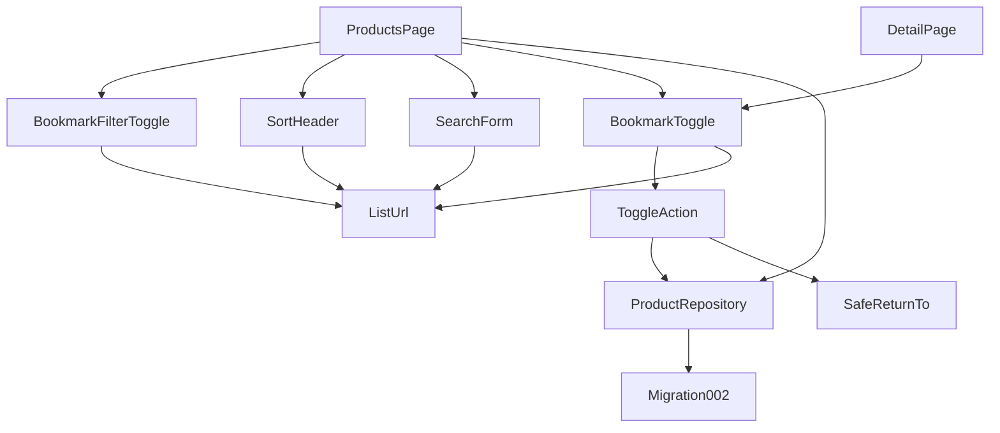
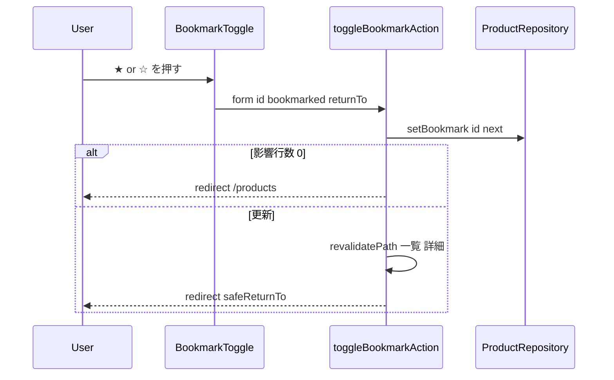

# Design Document: product-bookmark

## Overview

**Purpose**: 商品ごとのブックマークフラグを永続化し、一覧の各行と詳細から切り替え、一覧を「ブックマークのみ」で絞り込めるようにする。
**Users**: ローカル単一ユーザーが、見返したい商品に印を付けるために使う。
**Impact**: migration 002 で `products.bookmarked` を追加し、リポジトリに読み取り変換とフィルタ・更新を追加する。一覧 URL 規則に `bookmarked` を加え、ヘッダ・検索フォーム・新規のフィルタ切り替え・トグルがそれを共有する。

### Goals
- 一覧・詳細からトグルでき、JS 無効でも動く。操作後は同じ画面(同じ q / sort / bookmarked)に戻る
- `?bookmarked=1` フィルタが検索・並び替えと独立に組み合わさり、どの操作でも他の条件が保持される
- ON の行と詳細が視覚的に区別でき、状態が支援技術にも伝わる

### Non-Goals
- ユーザーごとのブックマーク、一括操作、編集モーダルでの変更
- 楽観的更新(即時反映)。操作はページ遷移を伴う

## Boundary Commitments

### This Spec Owns
- `products.bookmarked` 列(migration 002)と、その読み取り(`Product.bookmarked: boolean`)・更新(`setBookmark`)・フィルタ(`listProducts({ bookmarkedOnly })`)
- ブックマークトグル(`BookmarkToggle` + `toggleBookmarkAction`)と戻り先の検証(`safeReturnTo`)
- 一覧 URL 規則への `bookmarked` の追加(`buildProductsUrl`、`parseBookmarkedParam`)とフィルタ切り替え UI

### Out of Boundary
- 検索の一致規則、並び替えの規則、編集、削除の挙動(各 spec)。ただし `SortHeader` / `SearchForm` の props に `bookmarked` を通す変更は本 spec が行う
- ブックマークの `updated_at` への反映(しない)

### Allowed Dependencies
- `product-master`: `getDb`、`Product`、`parseProductId`、migration の仕組み
- `product-sort`: `buildProductsUrl`、`SortState`、`SortHeader`、`SearchForm`(拡張する)
- `next/cache`(`revalidatePath`)、`next/navigation`(`redirect`)
- 依存方向は従来どおり `lib → app → components`

### Revalidation Triggers
- `Product` 型への列追加(`bookmarked`)。`Product` を組み立てるコードは `rowToProduct` を通す
- `buildProductsUrl` の引数(`bookmarked` 追加)
- `SortHeader` / `SearchForm` の props 変更
- `schema_migrations` に 002 が加わる(`db.test.ts` の期待値)

## Architecture

### Existing Architecture Analysis
- 一覧ページは `q` / `sort` / `order` を読み、`listProducts` と `SortHeader` / `SearchForm` に渡す。URL は `buildProductsUrl` だけが組み立てる
- 削除は `DeleteButton`(client、confirm のためだけ)+ Server Action + `redirect("/products")`
- `Product` は `SELECT` 結果をそのままキャストしている(変換なし)

### Architecture Pattern & Boundary Map



**Architecture Integration**:
- Selected pattern: フラグ列 + フォーム/Server Action/redirect + URL 状態(`research.md`)
- Domain/feature boundaries: 永続化は `lib`、URL 規則は `list-url.ts`、UI は Server Component。client component は追加しない
- Existing patterns preserved: `buildProductsUrl` を唯一の URL 組み立て口とする。削除と同じ action パターン
- New components rationale: `BookmarkToggle`(一覧・詳細で同じフォーム)、`BookmarkFilterToggle`(フィルタ状態の表示と切り替え)
- Steering compliance: migration は追加のみ、ライブラリなし、`lib` は React 非依存、機能にテスト

### Technology Stack

| Layer | Choice / Version | Role in Feature | Notes |
|-------|------------------|-----------------|-------|
| Data | SQLite `ALTER TABLE ADD COLUMN` | `bookmarked INTEGER NOT NULL DEFAULT 0` | 002 migration |
| Backend | Server Action + `revalidatePath` + `redirect` | トグル | 戻り先は `safeReturnTo` で検証 |
| Frontend | Server Components、Tailwind | トグルボタン(form)、フィルタリンク、行ハイライト | `aria-pressed` |
| Testing | Vitest 4 | リポジトリ、URL 規則、migration | UI は手動 E2E |

## File Structure Plan

### Directory Structure
```
db/migrations/
└── 002_add_bookmarked_to_products.sql   # 新規: ALTER TABLE ADD COLUMN
src/components/
├── bookmark-toggle.tsx                  # 新規: form + hidden(id, bookmarked, returnTo) + ★/☆ ボタン
└── bookmark-filter-toggle.tsx           # 新規: 「ブックマークのみ表示」リンク(aria-pressed)
```

### Modified Files
- `src/lib/products.ts` — `Product.bookmarked: boolean` 追加、`ProductRow` と `rowToProduct`、`COLUMNS` に `bookmarked`、`ListProductsOptions.bookmarkedOnly`、`setBookmark(id, bookmarked): number`
- `src/lib/list-url.ts` — `ProductsUrlParams.bookmarked?: boolean`、`buildProductsUrl` が `bookmarked=1` を付ける、`parseBookmarkedParam(raw)`、`safeReturnTo(raw)`
- `src/components/sort-header.tsx` — props に `bookmarked: boolean` を追加し URL に含める
- `src/components/search-form.tsx` — props に `bookmarked: boolean` を追加。true なら hidden `bookmarked=1`。クリアのリンクも保持
- `src/app/products/page.tsx` — `bookmarked` を解釈し、フィルタ切り替え・ヘッダ・フォーム・各行のトグル(戻り先 = 現在の一覧 URL)に渡す。ON の行を強調。フィルタ有効で 0 件のメッセージ
- `src/app/products/[id]/page.tsx` — 定義リストに `bookmarked` 行(「ブックマーク中」/「-」)を追加し、ボタン列にトグル(戻り先 = `/products/{id}`)を置く
- `src/app/products/actions.ts` — `toggleBookmarkAction(formData)` を追加
- `tests/db.test.ts` — 適用済み migration の期待値を `["001_...", "002_..."]` に更新(既存テスト改変)
- `tests/products.test.ts`、`tests/list-url.test.ts` — 追加

## Requirements Traceability

| Requirement | Summary | Components | Interfaces | Flows |
|-------------|---------|------------|------------|-------|
| 1.1, 1.2 | 一覧行・詳細のトグル | BookmarkToggle, ProductsPage, DetailPage | - | - |
| 1.3, 1.4 | ON/OFF の保存 | ToggleAction, ProductRepository | `setBookmark` | トグル |
| 1.5, 1.6 | 同じ画面へ戻る | BookmarkToggle(returnTo), ToggleAction | `safeReturnTo`, `redirect` | トグル |
| 1.7 | JS 不要 | BookmarkToggle(form) | - | - |
| 1.8 | 不在 | ToggleAction | 影響行数 0 → `/products` | トグル |
| 2.1 | 永続化 | Migration002, ProductRepository | - | - |
| 2.2 | 既存行は OFF | Migration002 | `DEFAULT 0` | - |
| 2.3 | updated_at 不変 | ProductRepository | `setBookmark` | - |
| 2.4 | 削除で消える | 同一行 | - | - |
| 3.1, 3.2, 3.3, 3.4 | フィルタ UI と URL | BookmarkFilterToggle, ProductsPage, ListUrl | `buildProductsUrl`, `parseBookmarkedParam` | - |
| 3.5 | 不正値 | ListUrl | `parseBookmarkedParam` | - |
| 3.6 | 3 条件の独立適用 | ProductRepository | `listProducts({ keyword, sort, order, bookmarkedOnly })` | - |
| 3.7, 3.8 | 相互保持 | SortHeader, SearchForm, BookmarkFilterToggle | `buildProductsUrl` | - |
| 3.9 | フィルタ中に OFF | ToggleAction(returnTo に bookmarked=1) | - | トグル |
| 3.10 | 0 件 | ProductsPage | - | - |
| 4.1 | 行の強調とトグル見た目 | ProductsPage, BookmarkToggle | - | - |
| 4.2 | 詳細の表示 | DetailPage | - | - |
| 4.3 | aria-pressed | BookmarkToggle, BookmarkFilterToggle | - | - |
| 5.1, 5.2 | テスト、build / lint / test | tests/* | - | - |

## System Flows



## Components and Interfaces

| Component | Domain/Layer | Intent | Req Coverage | Key Dependencies (P0/P1) | Contracts |
|-----------|--------------|--------|--------------|--------------------------|-----------|
| Migration002 | db | 列追加 | 2.1, 2.2 | DbBootstrap (P0) | - |
| ProductRepository(拡張) | lib | 変換、フィルタ、更新 | 1.3, 1.4, 2.1, 2.3, 3.6 | - | Service |
| ListUrl(拡張) | lib | `bookmarked` の解釈・組み立て、戻り先検証 | 3.2–3.5, 3.7, 3.8, 1.5 | - | Service |
| ToggleAction | app | 更新 → 再検証 → 戻る | 1.3–1.6, 1.8, 3.9 | ProductRepository, ListUrl (P0) | Service |
| BookmarkToggle | components | form ボタン ★/☆ | 1.1, 1.2, 1.7, 4.1, 4.3 | ToggleAction (P0) | - |
| BookmarkFilterToggle | components | フィルタ切り替えリンク | 3.1–3.4, 3.8, 4.3 | ListUrl (P0) | - |
| ProductsPage / DetailPage(拡張) | app | 配線と表示 | 1.1, 1.2, 3.10, 4.1, 4.2 | 上記 | - |

### lib 層

#### ProductRepository(拡張、`src/lib/products.ts`)

##### Service Interface
```typescript
export interface Product {
  // 既存 8 列 +
  bookmarked: boolean;
}

export interface ListProductsOptions {
  keyword?: string;
  sort?: SortColumn;
  order?: SortOrder;
  bookmarkedOnly?: boolean; // true なら bookmarked = 1 のみ
}

/** bookmarked を設定し、影響行数(0 or 1)を返す。updated_at は変更しない。 */
export function setBookmark(id: number, bookmarked: boolean): number;
```
- 内部: `interface ProductRow { ...; bookmarked: 0 | 1 }`、`rowToProduct(row): Product`。`COLUMNS` に `bookmarked` を追加。WHERE は keyword 条件と `bookmarked = 1` を AND で結合(どちらも任意)
- Postconditions: `setBookmark` 後の `getProduct(id).bookmarked` は引数と一致。`updated_at` は前後で同一
- Invariants: `listProducts` の並び順・検索規則は変えない

**Implementation Notes**
- Validation: `tests/products.test.ts` — 既定は全件 `bookmarked: false`、`setBookmark(true/false)` の往復と影響行数、不在で 0、`updated_at` 不変、`bookmarkedOnly` 単独 / keyword 併用 / sort 併用、削除後は `getProduct` が null(フラグごと消える)
- `tests/db.test.ts` — 適用済み migration が 2 件、既存 DB(001 のみ適用済み・データあり)を開くと 002 が適用され既存行の `bookmarked` が 0

#### ListUrl(拡張、`src/lib/list-url.ts`)

##### Service Interface
```typescript
export interface ProductsUrlParams {
  keyword?: string;
  sort?: SortState;
  bookmarked?: boolean; // true のときだけ bookmarked=1 を付ける
}
export function buildProductsUrl(params: ProductsUrlParams): string; // 順序: q, sort, order, bookmarked

/** "1" のときだけ true */
export function parseBookmarkedParam(raw: string | undefined): boolean;

/** "/products" で始まり "//" で始まらない相対パスのみ許可。それ以外は "/products" */
export function safeReturnTo(raw: string | null | undefined): string;
```

**Implementation Notes**
- Validation: `tests/list-url.test.ts` — `parseBookmarkedParam("1" | "0" | "true" | undefined)`、`buildProductsUrl` の 3 条件の組み合わせと順序、`safeReturnTo("/products?q=a&bookmarked=1")` / `"/products/3"` / `"//evil"` / `"https://x"` / `"/other"` / `null`

### app 層

#### ToggleAction(`src/app/products/actions.ts`)
```typescript
/** hidden: id, bookmarked ("1" | "0"), returnTo */
export async function toggleBookmarkAction(formData: FormData): Promise<void>;
```
- 手順: `parseProductId` → null なら `redirect("/products")`。`setBookmark(id, bookmarked === "1")` → 影響 0 なら `redirect("/products")`。`revalidatePath("/products")`、`revalidatePath(`/products/${id}`)` → `redirect(safeReturnTo(returnTo))`
- `redirect` は `try/catch` の外

### components 層

#### BookmarkToggle(`src/components/bookmark-toggle.tsx`)
- Summary-only。Server Component。Props: `{ id: number; bookmarked: boolean; returnTo: string; label?: boolean }`
- `<form action={toggleBookmarkAction}>` に hidden `id`、`bookmarked`(次の状態: 現在 ON なら `0`、OFF なら `1`)、`returnTo`。ボタンは `aria-pressed={bookmarked}`、`aria-label="ブックマーク"`、表示は ON `★`(黄)/ OFF `☆`(灰)。`label` が true なら「ブックマーク中」/「ブックマーク」の文字を添える(詳細用)

#### BookmarkFilterToggle(`src/components/bookmark-filter-toggle.tsx`)
- Summary-only。Props: `{ active: boolean; keyword: string; sort?: SortState }`
- `Link` で `buildProductsUrl({ keyword, sort, bookmarked: !active })` へ。`aria-pressed={active}`。見た目はボタン風、active 時は塗り

#### ProductsPage(拡張)
- `bookmarked = parseBookmarkedParam(query.bookmarked)`。`returnTo = buildProductsUrl({ keyword, sort: formSort, bookmarked })`(URL に sort があるときだけ sort を含める。既存の `formSort` と同じ規則)
- 各行の先頭列に `BookmarkToggle`。ON の行に `bg-amber-50`。0 件メッセージはフィルタ有効時「ブックマークした商品はありません」(検索語があれば併記)
- `SortHeader` / `SearchForm` に `bookmarked` を渡す

#### DetailPage(拡張)
- 定義リストに `bookmarked` 行(「ブックマーク中」/「-」)。ボタン列(編集・削除の横)に `BookmarkToggle`(`label`、`returnTo=/products/{id}`)

## Data Models

### Physical Data Model(`db/migrations/002_add_bookmarked_to_products.sql`)
```sql
ALTER TABLE products ADD COLUMN bookmarked INTEGER NOT NULL DEFAULT 0;
```
- 値は 0 / 1。索引なし(数十件規模)

## Error Handling
- 不正 id / 不在: `/products` へ戻す(要件 1.8)
- 不正な `returnTo`: `/products` へ戻す
- 不正な `bookmarked` 値(`"1"` 以外): OFF として保存

## Testing Strategy
- **Integration(`tests/products.test.ts`、`tests/db.test.ts`)**: 上記 Implementation Notes
- **Unit(`tests/list-url.test.ts`)**: 上記
- **手動 E2E**: 一覧で ☆ → ★ になり行が強調、URL は同じ → フィルタ ON で `?bookmarked=1` とその商品だけ → 検索語を入れて検索してもフィルタ維持 → ヘッダで並び替えてもフィルタと検索語維持 → フィルタ中に ★ を外すと行が消える → 詳細で「ブックマーク中」とトグル → JS 無効相当(curl で POST)でも動く
