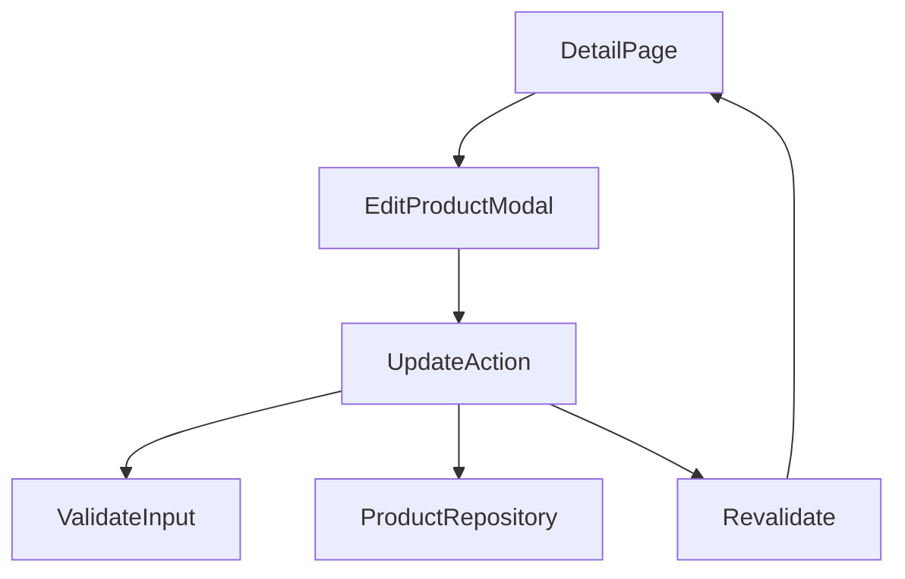
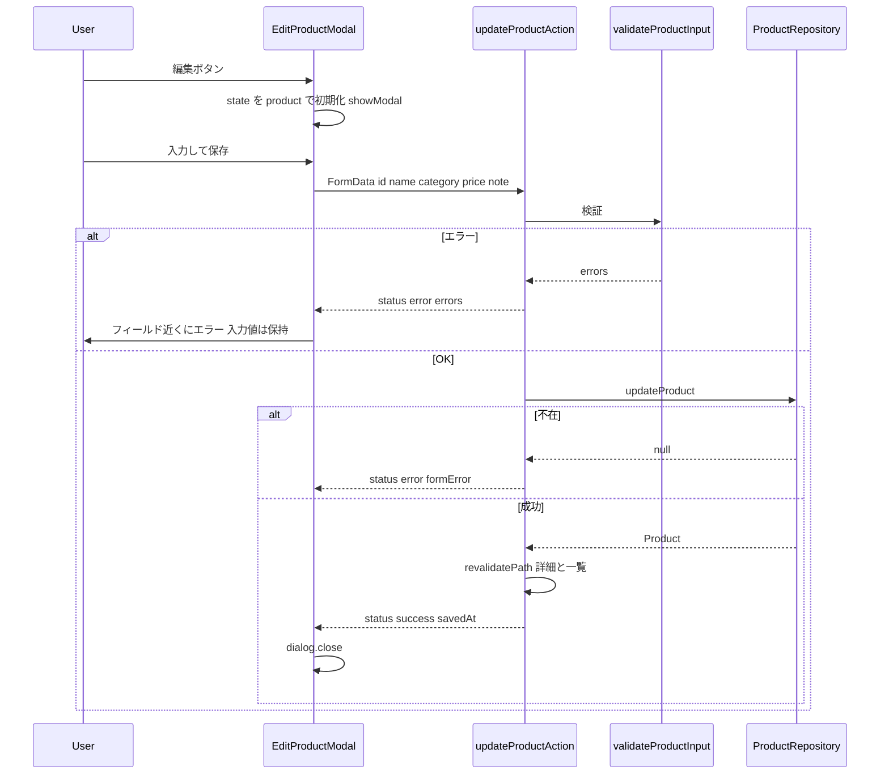

# Design Document: product-edit

## Overview

**Purpose**: 商品詳細画面からモーダルで name, category, price, note を編集・保存できるようにする。
**Users**: ローカル単一ユーザーが、商品情報の修正に使う。
**Impact**: 詳細画面に編集モーダル(client component)を追加し、Server Action に更新処理、リポジトリに `updateProduct`、`lib` に入力検証を追加する。既存関数の変更はない。

### Goals
- モーダルで 4 項目を編集し、サーバ側検証のエラーをフィールド近くに表示する
- 保存成功でモーダルが閉じ、詳細画面が同じレスポンスで更新される(`updated_at` 含む)
- キャンセル / Esc で入力を破棄する

### Non-Goals
- 商品の新規登録、code の変更、一覧からの編集
- 画面側の即時検証(送信前のリアルタイム表示)
- JS 無効時の編集(モーダルは JS 前提。閲覧・削除・検索・並び替えは従来どおり JS 不要)

## Boundary Commitments

### This Spec Owns
- 商品入力の検証規則(`validateProductInput`)と、その結果型(`ProductInput`、`FieldErrors`)
- 商品の更新(`updateProduct`)と、`updated_at` の更新規則
- 編集モーダルの UI・状態(開閉、入力値、エラー表示、pending)と `updateProductAction`

### Out of Boundary
- 詳細画面の他の要素(全列表示、一覧へ戻る、削除)、一覧・検索・並び替え
- products のスキーマ(変更なし。migration は追加しない)
- 新規登録(将来 spec)。ただし `validateProductInput` は code を含まない入力の検証として再利用可能な形にする

### Allowed Dependencies
- `product-master` の `Product` 型、`getDb`、`nowIso`、`parseProductId`
- `react`(`useActionState`、`useState`、`useEffect`、`useRef`)、`next/cache`(`revalidatePath`)
- HTML `<dialog>`(ライブラリは追加しない)
- 依存方向: `lib/product-input → lib/products → app/actions → components/edit-product-modal → app/[id]/page`。`lib` は React に依存しない

### Revalidation Triggers
- `ProductInput` の項目の増減(新規登録 spec が再利用する場合)
- `updateProductAction` の戻り値の型(`EditState`)の変更
- 詳細ページの `product` prop の形の変更

## Architecture

### Existing Architecture Analysis
- 詳細ページは Server Component で `getProduct` を呼び、`DeleteButton`(client)を置いている
- `actions.ts` は `"use server"` ファイルで `deleteProductAction` のみ
- `products.ts` に読み取りと削除はあるが更新はない。`nowIso()` は `time.ts` から再エクスポート済み

### Architecture Pattern & Boundary Map



**Architecture Integration**:
- Selected pattern: `<dialog>` + Server Action + `useActionState`(`research.md`)
- Domain/feature boundaries: 検証は `lib`(純粋)、永続化は `lib`(DB)、UI 状態は client component。Server Action は 3 つを配線するだけ
- Existing patterns preserved: Server Action は `FormData` を受け取り `lib` を呼ぶ。client component は最小(モーダル 1 つ)
- New components rationale: `EditProductModal`(開閉・入力・エラー表示を 1 つの client component に閉じる)、`ValidateInput`(規則をテスト可能に)
- Steering compliance: ライブラリ追加なし、`lib` は React 非依存、機能にテスト

### Technology Stack

| Layer | Choice / Version | Role in Feature | Notes |
|-------|------------------|-----------------|-------|
| Frontend | React 19.2(`useActionState`)、HTML `<dialog>`、Tailwind | モーダル、フォーム状態、pending | 制御コンポーネント |
| Backend | Next.js Server Action、`revalidatePath` | 検証・更新・再描画 | `redirect` は使わない |
| Data | better-sqlite3 | `UPDATE products` | 影響行数で不在を判定 |
| Testing | Vitest 4 | 検証関数とリポジトリ | UI は手動 E2E |

## File Structure Plan

### Directory Structure
```
src/
├── components/
│   └── edit-product-modal.tsx   # 新規: 'use client'。編集ボタン + <dialog> + フォーム
└── lib/
    └── product-input.ts         # 新規: ProductInput 型、FieldErrors 型、validateProductInput(純粋関数)
tests/
└── product-input.test.ts        # 新規: 検証規則
```

### Modified Files
- `src/lib/products.ts` — `updateProduct(id, input)` を追加(既存関数は変更しない)
- `src/app/products/actions.ts` — `updateProductAction(prevState, formData)` と `EditState` 型を追加
- `src/app/products/[id]/page.tsx` — `DeleteButton` の横に `EditProductModal` を置く
- `tests/products.test.ts` — `updateProduct` のテストを追加

## System Flows



- キャンセル / Esc: `dialog.close()` → `close` イベントで state を `product` に戻す(保存せず)
- 成功時のレスポンスには再描画された詳細ページが含まれるため、`product` prop が新しい値になる

## Requirements Traceability

| Requirement | Summary | Components | Interfaces | Flows |
|-------------|---------|------------|------------|-------|
| 1.1, 1.2 | 編集ボタンとモーダル | EditProductModal | `showModal()` | 編集フロー |
| 1.3, 4.3 | 現在値で初期化 | EditProductModal | `openModal()` | 編集フロー |
| 1.4 | code は表示のみ | EditProductModal | - | - |
| 1.5, 1.6, 4.2 | inert、フォーカス、Esc | `<dialog>` | `autoFocus`、`close` イベント | - |
| 2.1, 2.2, 2.3, 2.4, 2.7 | 検証規則 | ValidateInput | `validateProductInput` | - |
| 2.5 | 入力値保持 | EditProductModal | 制御コンポーネント | - |
| 2.6 | サーバ側検証 | UpdateAction | `updateProductAction` | 編集フロー |
| 3.1, 3.3, 3.4 | 保存と updated_at、trim、不変列 | ProductRepository, ValidateInput | `updateProduct` | 編集フロー |
| 3.2, 3.7 | 閉じて更新、一覧にも反映 | UpdateAction, EditProductModal | `revalidatePath`、`savedAt` | 編集フロー |
| 3.5 | 不在 | ProductRepository, UpdateAction | `null` → `formError` | 編集フロー |
| 3.6 | 二重送信防止 | EditProductModal | `pending` | - |
| 4.1, 4.4 | キャンセル | EditProductModal | `close` イベント | - |
| 5.1, 5.2 | テスト、build / lint / test | tests/* | - | - |

## Components and Interfaces

| Component | Domain/Layer | Intent | Req Coverage | Key Dependencies (P0/P1) | Contracts |
|-----------|--------------|--------|--------------|--------------------------|-----------|
| ValidateInput(`product-input.ts`) | lib | 生値の検証と正規化 | 2.1–2.4, 2.7, 3.3 | - | Service |
| ProductRepository(拡張) | lib | 更新と updated_at | 3.1, 3.4, 3.5 | ValidateInput の型 (P0) | Service |
| UpdateAction(`actions.ts`) | app | 配線と再検証 | 2.6, 3.2, 3.5, 3.7 | ValidateInput, ProductRepository (P0) | Service |
| EditProductModal | components(client) | ボタン、dialog、フォーム、状態 | 1.x, 2.5, 3.2, 3.6, 4.x | UpdateAction (P0) | State |
| DetailPage(拡張) | app | モーダルの配置 | 1.1 | EditProductModal (P0) | - |

### lib 層

#### ValidateInput(`src/lib/product-input.ts`)

| Field | Detail |
|-------|--------|
| Intent | FormData 由来の文字列を検証し、保存可能な `ProductInput` に正規化する |
| Requirements | 2.1, 2.2, 2.3, 2.4, 2.7, 3.3 |

**Contracts**: Service [x]

##### Service Interface
```typescript
export interface ProductInput {
  name: string;        // trim 済み、空でない
  category: string;    // trim 済み、空でない
  price: number;       // 0 以上の安全な整数
  note: string | null; // trim 後に空なら null
}

export type ProductInputField = "name" | "category" | "price" | "note";
export type FieldErrors = Partial<Record<ProductInputField, string>>;

export interface RawProductInput {
  name: string | null;
  category: string | null;
  price: string | null;
  note: string | null;
}

export type ValidationResult =
  | { ok: true; value: ProductInput }
  | { ok: false; errors: FieldErrors };

export function validateProductInput(raw: RawProductInput): ValidationResult;
```
- Postconditions: `ok: false` のとき `errors` は不正な全項目を含む(同時表示)。メッセージ: name / category は「必須です」、price は「0 以上の整数で入力してください」
- Invariants: price は `/^\d+$/` に一致し `Number.isSafeInteger`。`null` は空文字として扱う

**Implementation Notes**
- Validation: `tests/product-input.test.ts`。空 / 空白のみ / 前後空白付き、price の `""`、`"1.5"`、`"-1"`、`"abc"`、`"1e3"`、`"0"`、`"0042"`(→ 42)、`" 12 "`(→ 12)、note の `""` / `"  "` → null、複数エラー同時

#### ProductRepository(拡張、`src/lib/products.ts`)

##### Service Interface
```typescript
import type { ProductInput } from "./product-input";

/** 4 項目と updated_at を更新し、更新後の行を返す。不在なら null。 */
export function updateProduct(id: number, input: ProductInput): Product | null;
```
- Postconditions: `updated_at = nowIso()`、`id` / `code` / `created_at` は不変
- Invariants: 影響行数 0 → `null`(削除済み)

**Implementation Notes**
- Validation: `tests/products.test.ts` に「値と updated_at が更新される」「code / created_at が不変」「不在で null」「一覧・検索に新しい値が出る」を追加

### app 層

#### UpdateAction(`src/app/products/actions.ts`)

##### Service Interface
```typescript
export type EditState =
  | { status: "idle" }
  | { status: "error"; errors: FieldErrors; formError?: string }
  | { status: "success"; savedAt: string };

export async function updateProductAction(prevState: EditState, formData: FormData): Promise<EditState>;
```
- 手順: `id` を `parseProductId` → 不正なら `formError`。`validateProductInput` → エラーなら `status: "error"`。`updateProduct` → `null` なら `formError: "商品が見つかりません"`。成功なら `revalidatePath(`/products/${id}`)` と `revalidatePath("/products")` を呼び `{ status: "success", savedAt: nowIso() }`
- `redirect` / `throw` はしない(モーダルが結果を表示する)

### components 層

#### EditProductModal(`src/components/edit-product-modal.tsx`)

| Field | Detail |
|-------|--------|
| Intent | 編集ボタン、`<dialog>`、制御フォーム、エラー表示、pending、開閉制御 |
| Requirements | 1.1–1.6, 2.5, 3.2, 3.6, 4.1–4.4 |

**Contracts**: State [x]

##### State Management
- Props: `{ product: Product }`
- State: `values: { name, category, price: string, note }`(制御)、`useActionState(updateProductAction, { status: "idle" })`
- `openModal()`: `values` を `product` から初期化 → `dialog.showModal()`
- `<dialog onClose>`: `values` を `product` に戻す(キャンセル / Esc / 成功後の close で共通)
- `useEffect([state])`: `state.status === "success"` かつ `savedAt` が前回と異なれば `dialog.close()`
- フォーム: hidden `id`、読み取り専用表示の `code`、`name`(`autoFocus`)、`category`、`price`(`type="text" inputMode="numeric"`)、`note`(`textarea`)。各入力の直下に `state.errors[field]` を `aria-describedby` 付きで表示。`formError` はフォーム上部
- ボタン: 保存(`disabled={pending}`)、キャンセル(`type="button"` → `dialog.close()`)

**Implementation Notes**
- Integration: 詳細ページで `<EditProductModal product={product} />` を `DeleteButton` の横に置く
- Validation: 手動 E2E(下記)
- Risks: `<dialog>` の `close` イベントは `showModal` 中の Esc でも発火する(要件 4.2 はこれで満たす)

## Data Models
- 変更なし。`UPDATE` のみ

## Error Handling
- 検証エラー: フィールド直下に表示、入力値保持、モーダルは開いたまま
- 不在(削除済み): フォーム上部に「商品が見つかりません」。モーダルは開いたまま。ユーザーがキャンセルすれば詳細ページ側は次の操作で 404 になる
- DB 制約違反: 本 spec の入力では起こらない(code は変更しない、price は検証済み)

## Testing Strategy
- **Unit(`tests/product-input.test.ts`)**: 上記 ValidateInput の一覧
- **Integration(`tests/products.test.ts`)**: `updateProduct` の 4 ケース
- **手動 E2E**: 編集 → 現在値表示 → name を空、price を `abc` にして保存 → 両方のエラーが出て入力値が残る → 修正して保存 → モーダルが閉じ詳細の値と updated_at が変わる → 一覧でも新しい name → 再度開いてキャンセル / Esc → 値が戻る
