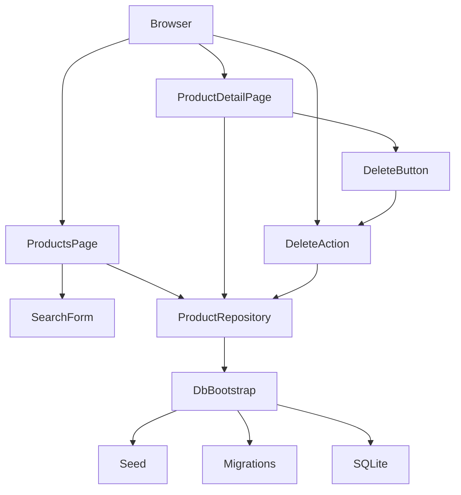
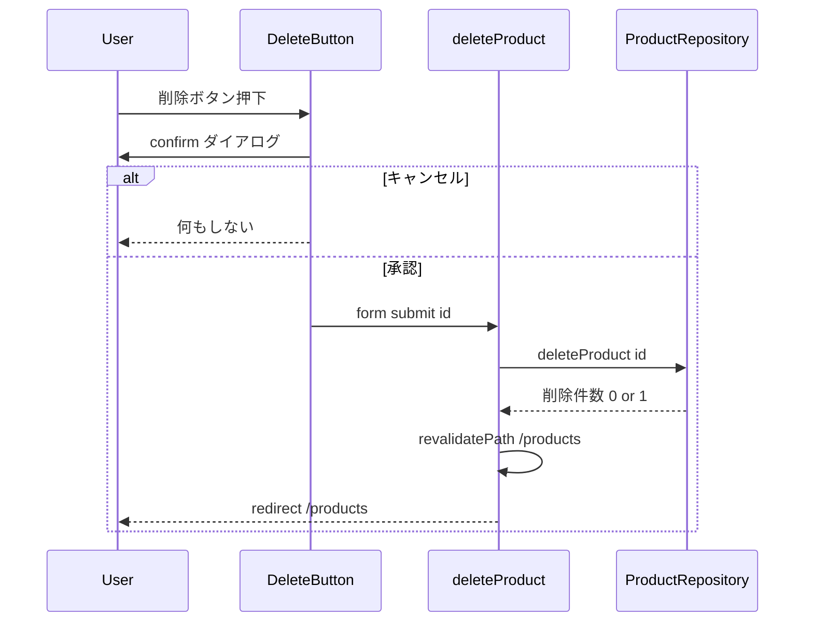

# Design Document: product-master

## Overview

**Purpose**: 商品マスタ(products)をローカルで閲覧・保守する Web アプリの初回リリース。一覧・検索・詳細・削除と、データの永続化・初期投入を提供する。
**Users**: ローカル単一ユーザー(認証なし)が商品の把握・整理に使う。
**Impact**: create-next-app の scaffold を置き換え、`src/lib` にデータ層、`src/app/products` に画面、`db/migrations` にスキーマを新設する。

### Goals
- 依頼された 4 機能(一覧、検索、詳細、削除)を JS 無効でも動く Server Component / Server Action で実装する
- スキーマを SQL マイグレーションで管理し、初回アクセス時に冪等に適用・シードする
- `lib` 層を Vitest で結合テストし、`build` / `lint` / `test` が通る

### Non-Goals
- 商品の新規登録・編集、並び替え、ページング
- 認証・認可、外部通信
- API(Route Handler)の公開
- ダークモード対応

## Boundary Commitments

### This Spec Owns
- `products` テーブルのスキーマ(migration 001)と、そのデータアクセス関数(`src/lib/products.ts`)
- DB 接続・マイグレーション適用・シード投入の仕組み(`src/lib/db.ts`、`src/lib/seed.ts`)
- `/products` 配下の画面と削除 Server Action、`/` から `/products` への誘導
- README の起動手順、Vitest の設定

### Out of Boundary
- products 以外のテーブル、ユーザー概念
- 商品の作成・更新 UI(将来 spec)。ただし `updated_at` を設定する共通関数は本 spec で用意する
- 認証・認可(steering `rules.md` により現時点では対象外)

### Allowed Dependencies
- `next`(App Router、`next/navigation`、`next/cache`)、`react`
- `better-sqlite3`(`src/lib/db.ts` からのみ直接利用する)
- `node:fs` / `node:path`(DB ディレクトリ作成、migration ファイル読み込み)
- 依存方向: `lib/db → lib/seed → lib/products → app(pages, actions) → components`。`lib` は React・Next に依存しない

### Revalidation Triggers
- `products` の列追加・制約変更(migration 追加)
- `ProductRepository` の関数シグネチャ変更
- DB 初期化のタイミング・パス解決ルールの変更
- URL 構造(`/products`、`/products/[id]`、`?q=`)の変更

## Architecture

### Architecture Pattern & Boundary Map



**Architecture Integration**:
- Selected pattern: App Router 直結のレイヤ構成(API 層なし)。理由は `research.md` の Pattern Evaluation 参照
- Domain/feature boundaries: 画面(`app`)は表示と入力の受け取りのみ。SQL とバリデーションは `lib` に閉じる
- Existing patterns preserved: create-next-app の `src/app`、`@/` エイリアス、Tailwind
- New components rationale: `DbBootstrap`(接続と初期化を 1 か所に)、`ProductRepository`(SQL を画面から隔離)、`DeleteButton`(確認ダイアログのためだけの client component)
- Steering compliance: `rules.md`(スタック固定、`data/app.db`、migration 追記のみ、機能ごとにテスト)、`structure.md`(`app → components → lib`)

### Technology Stack

| Layer | Choice / Version | Role in Feature | Notes |
|-------|------------------|-----------------|-------|
| Frontend | Next.js 16.3.4 App Router、React 19.2.8、Tailwind CSS 4 | Server Component で描画。`DeleteButton` のみ client | `params` / `searchParams` は Promise |
| Backend / Services | Next.js Server Action | 削除の副作用 | `redirect` は `try/catch` の外で呼ぶ |
| Data / Storage | better-sqlite3 13.0.3(SQLite 3.53) | `data/app.db`。同期 API | `serverExternalPackages` に登録 |
| Testing | Vitest 4.1.11 | `lib` の結合テスト(実ファイル DB) | `DATABASE_PATH` で一時 DB を指定 |
| Infrastructure / Runtime | Node.js 20+(検証環境 25.6) | | |

## File Structure Plan

### Directory Structure
```
db/
└── migrations/
    └── 001_create_products.sql   # products テーブル
data/
└── .gitkeep                      # app.db の置き場(*.db は git 管理外)
src/
├── app/
│   ├── layout.tsx                # 共通レイアウト(ヘッダ + main)。scaffold を置き換え
│   ├── globals.css               # Tailwind 読み込み。ダークモード定義を削除
│   └── products/
│       ├── page.tsx              # 一覧 + 検索(searchParams.q)
│       ├── actions.ts            # 'use server' deleteProduct
│       └── [id]/
│           ├── page.tsx          # 詳細(params.id)
│           └── not-found.tsx     # 404 画面
├── components/
│   ├── search-form.tsx           # GET フォーム(Server Component)
│   └── delete-button.tsx         # 'use client' 確認ダイアログ + フォーム送信
└── lib/
    ├── db.ts                     # 接続 singleton、migration 適用、シード呼び出し、テスト用 reset
    ├── seed.ts                   # 初期 20 件のデータと投入関数
    ├── time.ts                   # nowIso()。seed と products の両方から使うため分離(db → seed → products → db の循環 import を避ける)
    └── products.ts               # Product 型、一覧/検索/取得/削除、id 解析、LIKE エスケープ
tests/
├── db.test.ts                    # migration 適用・冪等性・シード
└── products.test.ts              # 一覧順序、検索(部分一致・大小・エスケープ・空)、取得、削除
vitest.config.mts                 # node 環境、@ エイリアス
```

### Modified Files
- `next.config.ts` — `serverExternalPackages: ["better-sqlite3"]`、`redirects()` で `/` → `/products`
- `package.json` — `"test": "vitest run"` を追加
- `.gitignore` — `/data/*.db`、`/data/*.db-wal`、`/data/*.db-shm` を追加
- `README.md` — scaffold の内容を起動手順(要件 6.4)に置き換え
- `src/app/page.tsx` — 削除(`/` は `redirects()` で誘導)

## System Flows

### 削除フロー



- 削除件数 0(すでに存在しない)でもエラーにせず一覧へ戻る(4.6)
- id が数値でない場合は Server Action 側で拒否せず、削除件数 0 として一覧へ戻す(UI からは到達しない)

## Requirements Traceability

| Requirement | Summary | Components | Interfaces | Flows |
|-------------|---------|------------|------------|-------|
| 1.1, 1.2, 1.3, 1.4 | 一覧表示・列・詳細導線・code 昇順 | ProductsPage, ProductRepository | `listProducts` | - |
| 1.5 | 0 件表示 | ProductsPage | - | - |
| 1.6 | `/` → `/products` | next.config `redirects` | - | - |
| 2.1, 2.2, 2.3, 2.4 | 検索ボックス・部分一致・URL 反映・リロード保持 | SearchForm, ProductsPage, ProductRepository | `listProducts({ keyword })` | - |
| 2.5, 2.6, 2.7 | 空検索・大小無視・エスケープ | ProductRepository | `escapeLike`, `listProducts` | - |
| 2.8 | 0 件でも検索語保持 | ProductsPage, SearchForm | - | - |
| 3.1, 3.2 | 全列表示・note 空 | ProductDetailPage, ProductRepository | `getProduct` | - |
| 3.3, 3.4 | 404 | ProductDetailPage, not-found | `parseProductId`, `notFound()` | - |
| 3.5 | 一覧へ戻る導線 | ProductDetailPage | - | - |
| 4.1, 4.2, 4.4 | 削除操作・確認・取り消し | DeleteButton | - | 削除フロー |
| 4.3, 4.5, 4.6 | 削除実行・反映・不在時 | deleteProduct action, ProductRepository | `deleteProduct` | 削除フロー |
| 5.1 | 永続化 | DbBootstrap | `getDb` | - |
| 5.2, 5.3 | シード投入・再投入なし | DbBootstrap, Seed | `seedIfEmpty` | - |
| 5.4 | code 一意・price ≥ 0 | migration 001 | CHECK / UNIQUE 制約 | - |
| 6.1 | `npm run dev` で動く | DbBootstrap(初回アクセス時初期化) | - | - |
| 6.2 | build / lint / test | vitest.config, next.config | - | - |
| 6.3 | 機能ごとのテスト | tests/* | - | - |
| 6.4 | README | README.md | - | - |

## Components and Interfaces

| Component | Domain/Layer | Intent | Req Coverage | Key Dependencies (P0/P1) | Contracts |
|-----------|--------------|--------|--------------|--------------------------|-----------|
| DbBootstrap | lib | 接続 singleton、migration 適用、シード呼び出し | 5.1, 5.2, 5.3, 6.1 | better-sqlite3 (P0), Seed (P1) | Service |
| Seed | lib | 初期 20 件の定義と投入 | 5.2, 5.3 | DbBootstrap (P0) | Service |
| ProductRepository | lib | products の読み書き、検索、id 解析 | 1.x, 2.x, 3.x, 4.x, 5.4 | DbBootstrap (P0) | Service |
| ProductsPage | app | 一覧 + 検索結果の描画 | 1.1–1.5, 2.2–2.4, 2.8 | ProductRepository (P0), SearchForm (P1) | - |
| SearchForm | components | `?q=` を付ける GET フォーム | 2.1, 2.3, 2.8 | - | - |
| ProductDetailPage | app | 全列表示、404、削除導線 | 3.1–3.5, 4.1 | ProductRepository (P0), DeleteButton (P1) | - |
| DeleteButton | components(client) | 確認ダイアログ後に Server Action を送信 | 4.1, 4.2, 4.4 | deleteProduct action (P0) | - |
| deleteProduct action | app | 削除の副作用と一覧への遷移 | 4.3, 4.5, 4.6 | ProductRepository (P0) | Service |

### lib 層

#### DbBootstrap(`src/lib/db.ts`)

| Field | Detail |
|-------|--------|
| Intent | プロセス内で 1 つの SQLite 接続を保持し、初回取得時に migration とシードを冪等に適用する |
| Requirements | 5.1, 5.2, 5.3, 6.1 |

**Responsibilities & Constraints**
- DB パスは `process.env.DATABASE_PATH ?? "data/app.db"`(プロジェクトルート基準)。親ディレクトリがなければ作る
- `schema_migrations(name TEXT PRIMARY KEY, applied_at TEXT)` を自前で作り、`db/migrations/*.sql` をファイル名昇順で未適用分だけ適用する。1 ファイル = 1 トランザクション
- migration 適用後に `seedIfEmpty(db)` を呼ぶ
- 接続は `globalThis` に退避し、HMR で多重に開かない
- `lib` は React / Next に依存しない

**Dependencies**
- Outbound: Seed — 初期データ投入 (P1)
- External: better-sqlite3 — 接続 (P0)、`node:fs` / `node:path` — ファイル操作 (P0)

**Contracts**: Service [x] / API [ ] / Event [ ] / Batch [ ] / State [ ]

##### Service Interface
```typescript
import type Database from "better-sqlite3";

/** 接続を返す。初回呼び出しで migrate → seed を実行する */
export function getDb(): Database.Database;

/** 適用済み migration 名(昇順)。テストと診断用 */
export function appliedMigrations(db: Database.Database): string[];

/** テスト専用: 接続を閉じ、次の getDb() で再初期化させる */
export function resetDbForTests(): void;
```
- Preconditions: `db/migrations/` が存在する
- Postconditions: `getDb()` 復帰時、全 migration が適用済みで、products が 0 件だったなら 20 件投入されている
- Invariants: 同一プロセスで接続は 1 つ。migration は同じ名前を二度適用しない

**Implementation Notes**
- Integration: `serverExternalPackages` がないと Turbopack がネイティブモジュールをバンドルして失敗する
- Validation: `tests/db.test.ts` で「2 回 `getDb()` しても migration が重複適用されない」「空 DB にシードされる」「既存データがあると再投入しない」を確認
- Risks: WAL モードは使わない(単一プロセス。`-wal` / `-shm` ファイルを増やさない)

#### Seed(`src/lib/seed.ts`)

| Field | Detail |
|-------|--------|
| Intent | 初期商品 20 件の定義と、products が空のときのみの投入 |
| Requirements | 5.2, 5.3 |

**Contracts**: Service [x]

##### Service Interface
```typescript
export type SeedProduct = Pick<Product, "code" | "name" | "category" | "price" | "note">;
export const SEED_PRODUCTS: readonly SeedProduct[]; // 20 件、code は一意、category は 4〜5 種類
/** products が 0 件なら SEED_PRODUCTS を投入して投入件数を返す。それ以外は 0 */
export function seedIfEmpty(db: Database.Database): number;
```
- Postconditions: 投入時は `created_at` = `updated_at` = 呼び出し時刻(ISO8601 UTC)

#### ProductRepository(`src/lib/products.ts`)

| Field | Detail |
|-------|--------|
| Intent | products テーブルへの読み書きを型付き関数で提供し、SQL を画面から隔離する |
| Requirements | 1.1–1.4, 2.2, 2.5–2.7, 3.1–3.4, 4.3, 4.5, 4.6, 5.4 |

**Responsibilities & Constraints**
- 一覧は常に `ORDER BY code ASC, id ASC`
- 検索語は trim し、空なら全件。`\`、`%`、`_` を `\` でエスケープして `LIKE ? ESCAPE '\'` で code / name / category を OR 検索
- `parseProductId` は `/^\d+$/` に一致し安全な整数範囲のもののみ number にする。それ以外は `null`
- 時刻は `nowIso()`(`new Date().toISOString()`)で生成する。将来の更新機能もこれを使う

**Dependencies**
- Outbound: DbBootstrap — `getDb()` (P0)

**Contracts**: Service [x]

##### Service Interface
```typescript
export interface Product {
  id: number;
  code: string;
  name: string;
  category: string;
  price: number;
  note: string | null;
  created_at: string; // ISO8601 UTC
  updated_at: string; // ISO8601 UTC
}

export interface ListProductsOptions {
  keyword?: string; // 未指定・空白のみ → 全件
}

export function listProducts(options?: ListProductsOptions): Product[];
export function getProduct(id: number): Product | null;
/** 削除した行数(0 or 1)を返す。存在しなくても例外にしない */
export function deleteProduct(id: number): number;
export function parseProductId(raw: string): number | null;
export function escapeLike(term: string): string;
export function nowIso(): string;
```
- Preconditions: `getDb()` が初期化済み(関数内で呼ぶため呼び出し側は意識しない)
- Postconditions: `deleteProduct` 後に `getProduct(id)` は `null`
- Invariants: `code` 一意、`price` は 0 以上の整数(DB 制約で保証。違反時は better-sqlite3 が例外を投げる)

**Implementation Notes**
- Validation: `tests/products.test.ts` で順序、部分一致、大小無視、`%` / `_` の文字どおり一致、空検索、`getProduct` の不在、`parseProductId` の境界、`deleteProduct` の冪等性
- Risks: 非 ASCII の大小は区別される(要件は英字のみ)

### app 層

#### ProductsPage(`src/app/products/page.tsx`)
- Summary-only。`await searchParams` から `q`(配列なら先頭)を取り、`listProducts({ keyword: q })` を描画する
- テーブル列: code(詳細へのリンク), name, category, price。0 件のときは「該当する商品はありません」と検索語を表示
- 検索フォームに現在の `q` を渡す

#### ProductDetailPage(`src/app/products/[id]/page.tsx`)
- Summary-only。`parseProductId(await params).id)` が `null` または `getProduct` が `null` なら `notFound()`
- 全 8 列を定義リストで表示。note が `null` なら空欄。一覧へ戻るリンクと `DeleteButton` を置く
- `not-found.tsx` は「商品が見つかりません」と一覧へのリンク

#### deleteProduct action(`src/app/products/actions.ts`)

| Field | Detail |
|-------|--------|
| Intent | フォームから id を受け取り削除し、一覧を再検証して遷移する |
| Requirements | 4.3, 4.5, 4.6 |

**Contracts**: Service [x]

##### Service Interface
```typescript
"use server";
/** formData.get("id") を parseProductId で解析。null なら削除せず一覧へ */
export async function deleteProductAction(formData: FormData): Promise<void>;
```
- Postconditions: `revalidatePath("/products")` の後に `redirect("/products")`。例外を投げない(不在・不正 id は削除件数 0 として扱う)
- `redirect` は `try/catch` の外で呼ぶ

### components 層

#### SearchForm(`src/components/search-form.tsx`)
- Summary-only。Server Component。`<form method="get" action="/products">` に `name="q"` の入力と検索ボタン。`defaultValue` に現在の `q`

#### DeleteButton(`src/components/delete-button.tsx`)
- Summary-only。`'use client'`。`<form action={deleteProductAction}>` に hidden `id` と送信ボタン。`onSubmit` で `window.confirm("この商品を削除しますか?")` が false なら `preventDefault()`
- Props: `{ id: number }`

## Data Models

### Domain Model
- 集約は `Product` 1 つ。トランザクション境界も 1 行
- 不変条件: `code` 一意、`price ≥ 0` の整数、`created_at ≤ updated_at`

### Physical Data Model(`db/migrations/001_create_products.sql`)
```sql
CREATE TABLE products (
  id         INTEGER PRIMARY KEY AUTOINCREMENT,
  code       TEXT    NOT NULL UNIQUE,
  name       TEXT    NOT NULL,
  category   TEXT    NOT NULL,
  price      INTEGER NOT NULL CHECK (price >= 0),
  note       TEXT,
  created_at TEXT    NOT NULL,
  updated_at TEXT    NOT NULL
);
```
- `schema_migrations` は `DbBootstrap` がコード側で作る(migration ファイルには含めない)
- 索引は `code` の UNIQUE のみ。数十件規模のため検索用索引は置かない

## Error Handling

### Error Strategy
- **不在**: 詳細は `notFound()` で 404 画面。削除は削除件数 0 として一覧へ
- **不正 id(非数値)**: 詳細は 404。削除は一覧へ
- **DB 制約違反**: 本 spec の操作(参照・削除)では発生しない。シードは code 一意を静的に保証する
- **DB ファイル作成失敗**: `getDb()` が例外を投げ、Next の error 画面になる(500)。README に `data/` の書き込み権限を記載

### Monitoring
- なし(ローカル用途)。migration 適用時は名前を `console.info` に出す

## Testing Strategy

- **Unit / Integration Tests(Vitest、実ファイル DB)**:
  - migration が適用され、2 回目の `getDb()` で重複適用されない(5.1, 6.1)
  - 空 DB でシード 20 件、再度呼んでも増えない(5.2, 5.3)
  - `listProducts()` が code 昇順で全件(1.1, 1.4)
  - 検索: 部分一致、大文字小文字無視、`%` / `_` の文字どおり一致、空白のみで全件(2.2, 2.5, 2.6, 2.7)
  - `getProduct` の存在 / 不在、`parseProductId` の `"abc"` / `"1.5"` / `"-1"` / `""`(3.1, 3.3, 3.4)
  - `deleteProduct` が 1 を返し、再度は 0、`getProduct` は `null`(4.3, 4.5, 4.6)
- **E2E / UI(手動)**: ブラウザで一覧 → 検索(URL に `?q=`)→ リロード → 詳細 → 削除確認(キャンセル / 承認)→ 一覧
- テストは `DATABASE_PATH` を一時ディレクトリに向け、`resetDbForTests()` で毎回初期化する

## Migration Strategy
- 001 のみ。ロールバックは `data/app.db` の削除(再起動で再作成・再シード)
