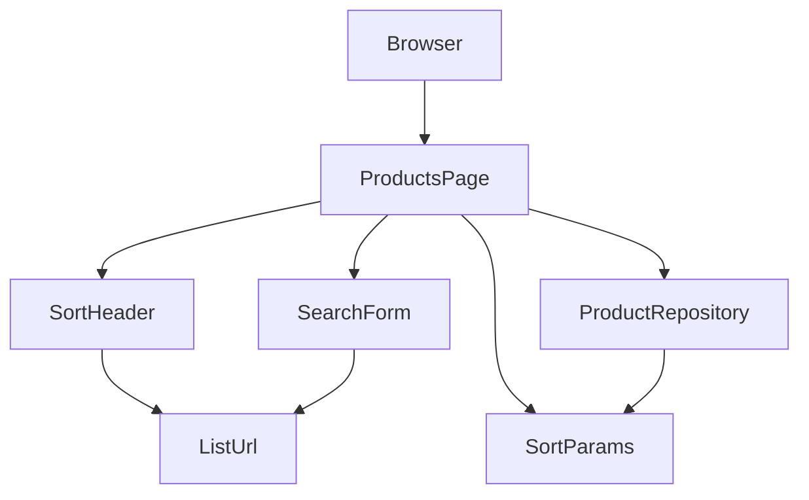

# Design Document: product-sort

## Overview

**Purpose**: 商品一覧の列ヘッダをクリックして並び替えられるようにし、その状態を URL クエリで再現可能にする。
**Users**: ローカル単一ユーザーが、価格順やカテゴリ順で商品を見比べるために使う。
**Impact**: `product-master` の一覧取得関数を列・方向指定に拡張し、一覧ページの列ヘッダをソートヘッダ部品に置き換え、検索フォームがソート状態を引き継ぐようにする。

### Goals
- 4 列それぞれで昇順/降順を切り替えられ、URL(`?sort=`、`?order=`)に反映される
- 検索(`?q=`)とソートが互いの状態を壊さない
- 指定なしのときの結果は現行(code 昇順)と同一

### Non-Goals
- 複数列ソート、並び順の永続化、ページング
- 文字列列の照合順序の変更(大文字小文字無視など)
- 詳細画面・削除の変更

## Boundary Commitments

### This Spec Owns
- ソート指定(`sort` / `order`)の解釈・検証規則と、その一覧取得への適用
- ソートヘッダ部品(表示、`aria-sort`、切り替え先 URL の生成)
- 一覧 URL の組み立て規則(`q` / `sort` / `order` の組み合わせ)

### Out of Boundary
- 検索の一致規則、詳細画面、削除(`product-master`)
- products のスキーマ(変更なし。migration は追加しない)

### Allowed Dependencies
- `product-master` の `listProducts` / `Product` 型(本 spec が `ListProductsOptions` を拡張する)
- `next/link`、React
- 依存方向は `product-master` と同じ: `lib → app → components`。`lib` は React に依存しない

### Revalidation Triggers
- `ListProductsOptions` の形の変更(`sort` / `order` の追加は互換だが、既定順の変更は非互換)
- 一覧 URL のクエリ名(`q` / `sort` / `order`)の変更
- `SearchForm` の props 変更

## Architecture

### Existing Architecture Analysis
- 一覧ページは Server Component で `searchParams` を読み、`listProducts` を呼んで描画する。検索は GET フォーム
- `listProducts` は `ORDER BY code ASC, id ASC` 固定。ここが唯一の並び順の決定点
- `SearchForm` は `keyword` のみを受け取る

### Architecture Pattern & Boundary Map



**Architecture Integration**:
- Selected pattern: サーバ側ソート + URL 状態(`research.md`)
- Domain/feature boundaries: ソート指定の解釈(`SortParams`)と URL 組み立て(`ListUrl`)は純粋関数として `lib` に置き、UI とリポジトリの両方が同じ規則を使う
- Existing patterns preserved: Server Component、GET フォーム、`lib` にロジックを集約
- New components rationale: `SortHeader`(4 列で同じ表示・リンク規則を共有)、`ListUrl`(ヘッダと検索フォームで URL 規則を共有)
- Steering compliance: 新しいライブラリなし、`lib` は React 非依存、機能にテストを付ける

### Technology Stack

| Layer | Choice / Version | Role in Feature | Notes |
|-------|------------------|-----------------|-------|
| Frontend | Next.js 16.3.4 App Router(Server Components)、`next/link` | ヘッダのリンク遷移 | client component は追加しない |
| Data | better-sqlite3 / SQLite | `ORDER BY` の列・方向 | 列名はホワイトリスト経由でのみ埋め込む |
| Testing | Vitest 4 | `lib` の純粋関数とリポジトリ | 既存テストは変更しない |

## File Structure Plan

### Directory Structure
```
src/
├── components/
│   └── sort-header.tsx         # 新規: <th> にリンクと方向の印、aria-sort
└── lib/
    └── list-url.ts             # 新規: parseSortParams と buildProductsUrl(純粋関数)
tests/
└── list-url.test.ts            # 新規: 解釈規則と URL 組み立て
```

### Modified Files
- `src/lib/products.ts` — `SortColumn` / `SortOrder` 型と `SORT_COLUMNS` を追加。`ListProductsOptions` に `sort` / `order` を追加し、`ORDER BY` を可変にする(省略時は code 昇順)
- `src/app/products/page.tsx` — `sort` / `order` を読み取り、`parseSortParams` の結果を `listProducts` と `SortHeader`、`SearchForm` に渡す。`<th>` 4 つを `SortHeader` に置き換える
- `src/components/search-form.tsx` — props に `sort` / `order`(任意)を追加し、指定時は hidden input を出す。クリアのリンクはソート状態を保持する
- `tests/products.test.ts` — 列ごとの昇順・降順と同値時の順序のテストを追加(既存テストは変更しない)

## Requirements Traceability

| Requirement | Summary | Components | Interfaces | Flows |
|-------------|---------|------------|------------|-------|
| 1.1, 1.6 | ヘッダがリンクで切り替え | SortHeader | `buildProductsUrl` | - |
| 1.2, 1.3 | 未ソート列は昇順、同列は反転 | SortHeader, ListUrl | `nextOrder` | - |
| 1.4, 1.5 | 数値/文字列順、同値は id | ProductRepository | `listProducts({ sort, order })` | - |
| 2.1, 2.2, 2.3 | 方向の印、非ソート列は無印、aria-sort | SortHeader | - | - |
| 3.1, 3.2 | URL 反映と再現 | ProductsPage, ListUrl | `parseSortParams`, `buildProductsUrl` | - |
| 3.3 | ソート切替時に q 保持 | SortHeader, ListUrl | `buildProductsUrl` | - |
| 3.4 | 検索時にソート保持 | SearchForm | hidden `sort` / `order` | - |
| 3.5, 3.6, 3.7 | 不正値・省略のフォールバック | SortParams | `parseSortParams` | - |
| 4.1, 4.2 | 既定 code 昇順と印 | SortParams, SortHeader | `DEFAULT_SORT` | - |
| 4.3 | 既存導線を変えない | ProductsPage | 既存テスト維持 | - |
| 5.1, 5.2 | テスト、build / lint / test | tests/* | - | - |

## Components and Interfaces

| Component | Domain/Layer | Intent | Req Coverage | Key Dependencies (P0/P1) | Contracts |
|-----------|--------------|--------|--------------|--------------------------|-----------|
| SortParams(`list-url.ts`) | lib | クエリ値の検証と既定化、次の方向の決定 | 1.2, 1.3, 3.5, 3.6, 3.7, 4.1 | - | Service |
| ListUrl(`list-url.ts`) | lib | `q` / `sort` / `order` から一覧 URL を組み立てる | 1.6, 3.1, 3.3 | SortParams (P0) | Service |
| ProductRepository(拡張) | lib | `sort` / `order` を ORDER BY に適用 | 1.4, 1.5, 4.1 | SortParams の型 (P0) | Service |
| SortHeader | components | リンク付き `<th>`、印、`aria-sort` | 1.1, 1.2, 1.3, 2.1, 2.2, 2.3, 4.2 | ListUrl (P0) | - |
| SearchForm(拡張) | components | hidden で sort / order を引き継ぐ | 3.4 | ListUrl (P1) | - |
| ProductsPage(拡張) | app | クエリ読み取りと配線 | 3.1, 3.2, 4.3 | 上記全て | - |

### lib 層

#### SortParams / ListUrl(`src/lib/list-url.ts`)

| Field | Detail |
|-------|--------|
| Intent | ソート指定の解釈規則と一覧 URL の組み立てを 1 か所に置く純粋関数群 |
| Requirements | 1.2, 1.3, 1.6, 3.1, 3.3, 3.5, 3.6, 3.7, 4.1 |

**Responsibilities & Constraints**
- DB・React に依存しない
- `sort` の許容値は `SORT_COLUMNS`(`products.ts` が所有)を参照する

**Contracts**: Service [x]

##### Service Interface
```typescript
import type { SortColumn, SortOrder } from "./products";

export interface SortState {
  sort: SortColumn;
  order: SortOrder;
}

export const DEFAULT_SORT: SortState; // { sort: "code", order: "asc" }

/**
 * クエリの生値を解釈する。
 * - sort が許容値以外 / 未指定 → DEFAULT_SORT(order も既定)
 * - sort が有効で order が "asc" / "desc" 以外 / 未指定 → その列の asc
 */
export function parseSortParams(rawSort: string | undefined, rawOrder: string | undefined): SortState;

/** ヘッダをクリックしたときの次の状態。同じ列なら反転、別の列なら asc */
export function nextSortState(current: SortState, column: SortColumn): SortState;

export interface ProductsUrlParams {
  keyword?: string;   // 空なら q を付けない
  sort?: SortState;   // 未指定なら sort / order を付けない
}

/** "/products" または "/products?q=...&sort=...&order=..." を返す。値は URL エンコードする */
export function buildProductsUrl(params: ProductsUrlParams): string;
```
- Postconditions: `parseSortParams` の戻り値の `sort` は必ず `SORT_COLUMNS` の要素
- Invariants: `buildProductsUrl({})` は `"/products"`

**Implementation Notes**
- Validation: `tests/list-url.test.ts`。`"price"`/`"desc"`、`"PRICE"`(不正→既定)、`"name"`/`undefined`(→ asc)、`"x"`/`"desc"`(→ 既定)、`nextSortState` の反転と切替、`buildProductsUrl` の q エンコード(日本語、`&`)
- Risks: なし

#### ProductRepository(拡張、`src/lib/products.ts`)

| Field | Detail |
|-------|--------|
| Intent | ORDER BY を列・方向で可変にする |
| Requirements | 1.4, 1.5, 4.1 |

**Contracts**: Service [x]

##### Service Interface
```typescript
export const SORT_COLUMNS = ["code", "name", "category", "price"] as const;
export type SortColumn = (typeof SORT_COLUMNS)[number];
export type SortOrder = "asc" | "desc";

export interface ListProductsOptions {
  keyword?: string;
  sort?: SortColumn;   // 省略時 "code"
  order?: SortOrder;   // 省略時 "asc"
}

export function listProducts(options?: ListProductsOptions): Product[];
```
- Preconditions: `sort` は型上 `SortColumn` に限定される。ページは必ず `parseSortParams` を通した値を渡す
- Postconditions: `ORDER BY <sort> <ORDER>, id ASC`。`sort` / `order` 省略時の結果は現行と同一
- Invariants: SQL に埋め込む列名は `SORT_COLUMNS` に含まれる文字列のみ(実行時にも `includes` で防御し、外れたら既定にする)

**Implementation Notes**
- Integration: 検索有無で分かれている 2 つの SQL の ORDER BY 部分を共通化する
- Validation: `tests/products.test.ts` に列ごとの asc / desc、price の数値順(`0 < 90 < 120 < ... < 3480`)、同値(ST-001 と ST-002 は price 120)の id 順を追加
- Risks: なし

### components 層

#### SortHeader(`src/components/sort-header.tsx`)
- Summary-only。Server Component。Props: `{ column: SortColumn; label: string; current: SortState; keyword: string; align?: "left" | "right" }`
- `<th aria-sort={active ? (asc ? "ascending" : "descending") : undefined}>` の中に `Link`。`href` は `buildProductsUrl({ keyword, sort: nextSortState(current, column) })`
- 表示: ラベル + アクティブ時のみ `▲` / `▼`。非アクティブ時は印なし
- 既定状態(指定なし)でも `current` は `DEFAULT_SORT` なので code に `▲` が付く(4.2)

#### SearchForm(拡張、`src/components/search-form.tsx`)
- Summary-only。Props に `sort?: SortState` を追加。指定時は `<input type="hidden" name="sort">` と `name="order"` を出す
- クリアのリンク先は `buildProductsUrl({ sort })`(検索語だけを消し、ソートは保持)

#### ProductsPage(拡張、`src/app/products/page.tsx`)
- Summary-only。`searchParams` から `q` / `sort` / `order` を取り、`parseSortParams` で `SortState` にする。URL に `sort` があるときだけ `SearchForm` に `sort` を渡す(初期表示では hidden を出さない)
- `listProducts({ keyword, sort, order })`。`<th>` を `SortHeader` ×4 に置き換える

## Data Models
- 変更なし(products テーブルのまま。索引も追加しない。数十件規模)

## Error Handling
- 不正な `sort` / `order` は `parseSortParams` が既定に丸めるため、エラー画面にはならない
- SQL 例外は発生しない(列名はホワイトリスト、方向は 2 値)

## Testing Strategy
- **Unit(`tests/list-url.test.ts`)**: `parseSortParams` の 6 通り(有効/不正/省略 × sort/order)、`nextSortState` の反転・切替、`buildProductsUrl` のエンコードと省略規則
- **Integration(`tests/products.test.ts` 追加分)**: 4 列 × asc/desc、price の数値順、同値時の id 順、`sort` 省略時が現行と同一
- **手動 E2E**: ヘッダクリックで URL が変わる → リロードで再現 → 検索語を入れて検索してもソートが残る → ソートを変えても検索語が残る → `?sort=x` で既定表示

## Open Questions / Risks
- 文字列列の照合は BINARY(大文字小文字を区別、日本語はコードポイント順)。要件は「文字列として並べる」のみのため現状維持。変更が必要なら別 spec
